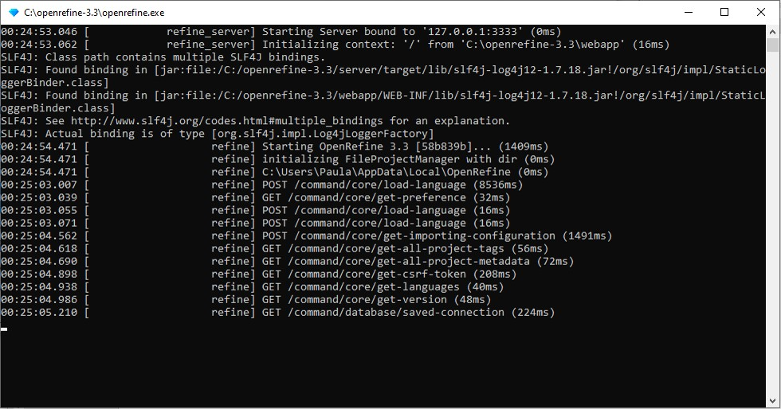
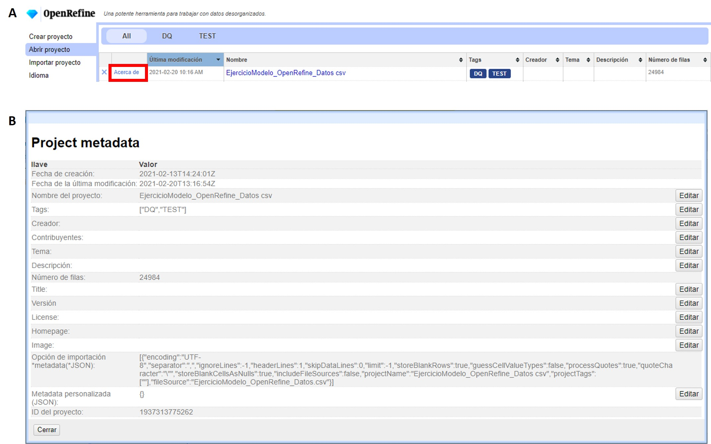

== Primeros pasos: datos y proyectos

=== Carga de datos y creación de un proyecto

Para comenzar a utilizar OpenRefine debe cargar sus datos en el programa y crear un proyecto. Para ello, siga los siguientes pasos:

****
[discrete]
=== Paso 1

*Abra la aplicación OpenRefine*. Si utiliza Windows, se abrirá una ventana de comandos que mostrará las acciones que OpenRefine está realizando (<>). *_No cierre esta ventana mientras esté trabajando con el programa._*

[#img-fig-01]
.Figura 1

OpenRefine se abrirá en el navegador que usted utilice por defecto inmediatamente después de ejecutar la aplicación (<>). Si OpenRefine no abre, puede acceder manualmente ingresando la siguiente URL en su navegador:
--
http://127.0.0.1:3333
--

Si bien puede ejecutar el programa utilizando cualquier navegador, nuestra recomendación es que utilice Google Chrome, pues otros navegadores suelen presentar diversos problemas, sobre todo cuando se intentan utilizar funciones más complejas.

NOTE: Si bien OpenRefine utiliza la interfaz de un navegador para trabajar, todos los procesos (e.g., creación de proyectos, carga de datos, procesamiento, etc.) se realizan localmente, es decir, en su computadora, sin subir datos en línea. Por tanto, para utilizar la mayoría de las funciones del programa no hace falta una conexión a Internet. Algunas funciones, sin embargo, como las <<sect-4,Consultas a servicios externos>>, sí requieren conexión.

[#img-fig-02]
.Figura 2
image::img/es.figure-02.jpg[Figura 2,width=1061,align=center]

En el menú de la izquierda tiene opciones para crear, abrir o importar proyectos. Si usted no tiene ningún proyecto aún, en la opción de “Abrir proyecto” verá una lista vacía. 

Además puede cambiar la configuración de idioma. Para ello, haga click en “Idioma” y en la siguiente pantalla (<>) seleccione el idioma preferido. Acepte los cambios. En esta guía se utilizará el idioma Español.

[#img-fig-03]
.Figura 3
image::img/es.figure-03.jpg[Figura 3,width=805,align=center]

****

****
[discrete]
=== Paso 2

*Cargue los datos* (<>). Dentro de la opción “Crear proyecto”, escoja el archivo que desea cargar. Note que hay varios formatos posibles de archivos que se pueden subir (tsv, csv, xls, json, etc). Haga click en “Siguiente”. 

Para seguir esta guía, cargue el archivo proporcionado, al que puede acceder a través del enlace provisto en la sección <<datos,Cómo usar esta guía: Datos>>.

NOTE: Si sube archivos con formato .xls o .xlsx, tenga en cuenta que no podrá modificar la codificación, y que pueden encontrarse algunos errores en los datos (ejemplo: los tildes en las palabras se verán como símbolos raros cuando cargue los datos). Para evitarse problemas, si trabaja con MS Excel es conveniente que exporte los datos como archivo .csv (de todas formas, tenga cuidado con la codificación, ver más abajo).

Verá entonces una pantalla como la que se muestra en la <>. Allí puede ncontrar dos cuadros de texto arriba a la derecha, uno para indicar el nombre de su proyecto, y otro que permite asignar etiquetas (“tags”) a su proyecto. Puede asignar tantas etiquetas como desee, escribiéndolas en el cuadro. Las etiquetas le ayudarán a organizar mejor sus proyectos, y podrá verlas y editarlas a través del menú “Abrir proyecto” junto al nombre de su proyecto (ver sección “Abrir un proyecto y modificar sus metadatos” más abajo para más detalles sobre cómo agregar o cambiar etiquetas y otros elementos de los metadatos de los proyectos). Además, en esta pantalla puede ver una muestra de sus datos (tabla) y modificar varios aspectos de la carga de los datos al programa: codificación, criterio para la separación en columnas, inclusión o no de la primera fila, etc.

OpenRefine sugiere algunas de las codificaciones más utilizadas cuando se hace click en el cuadro de texto “Codificación de caracteres”. Asegúrese de escoger correctamente la codificación. Si está utilizando el conjunto de datos de prueba proporcionado, escoja UTF-8 (<>).

OpenRefine presenta la opción de “Detectar y transformar texto en números, fechas, …”. Si esta opción es seleccionada, el programa tratará de interpretar ciertos campos transformándolos a determinados formatos. Por ejemplo, si detecta campos de fecha, tratará de colocar los valores de las celdas de ese campo en formato de fecha estándar. Dada la naturaleza de los datos sobre biodiversidad con los que solemos trabajar, estas interpretaciones pueden ser incorrectas e introducir más errores. Asegúrese entonces de desmarcar esta opción durante el paso de importación de datos.

[#img-fig-04]
.Figura 4
image::img/es.figure-04.jpg[Figura 4,width=1066,align=center]

[#img-fig-05]
.Figura 5
image::img/es.figure-05.jpg[Figura 5,width=471,align=center]

****

****
[discrete]
=== Paso 3

*Cree el proyecto*. Una vez que haya seleccionado las opciones de carga de datos, haga click en el botón “Crear Proyecto” arriba a la derecha.

NOTE: Cuando se cargan datos en OpenRefine y se crea un proyecto, el programa hace una copia de los datos provistos. De esta forma, el archivo local original nunca se modifica, garantizando no perder los datos originales.

****

****
[discrete]
=== Paso 4

*¡Felicitaciones!* Ya tiene un proyecto (lo verá como en la <>).

[#img-fig-06]
.Figura 6
image::img/es.figure-06.jpg[Figura 6,width=1061,align=center]

NOTE: El número total de filas cargadas se muestra en este momento arriba de la tabla en negrita (para el caso del conjunto de datos provisto, 24984 filas). Sin embargo, verá que el número de filas mostradas en la tabla es limitado. No desespere, OpenRefine sólo muestra hasta 50 filas. Las acciones que uno pueda tomar en la aplicación, sin embargo, pueden tener efecto sobre otras filas aunque éstas no sean mostradas.

****

=== Abrir un proyecto y modificar sus metadatos

Una vez que ha creado uno o más proyectos, podrá acceder a ellos a través del menú “Abrir proyecto” (<>. Cuando ingresa a este menú, verá listados todos sus proyectos, con una serie de metadatos básicos que puede utilizar para ordenar su lista (<>). Los metadatos mostrados incluyen el nombre del proyecto, la fecha de última modificación, las etiquetas asignadas (“tags”), el número de filas, etc.

[#img-fig-07]
.Figura 7

Si desea editar los metadatos, debe ingresar a la opción “Acerca de”, a la izquierda en la tabla de proyectos (<>). Se abrirá entonces una ventana como la mostrada en la <>. Si desea modificar los distintos elementos de los metadatos, puede utilizar el botón “Editar” sobre cada parámetro. Por ejemplo, si olvidó colocar una etiqueta al crear un proyecto, puede hacerlo más tarde desde este menú. Contar con buenos metadatos puede ayudarle a organizar sus proyectos, sobre todo lleva a cabo trabajo colaborativo.

=== Asignar suficientes recursos al programa
Para que OpenRefine pueda funcionar correctamente se requiere contar con suficiente memoria en la computadora asignada al programa. Especialmente si se trabajará con conjuntos de datos grandes, la memoria asignada afectará la velocidad de procesamiento e incluso podría limitar la capacidad para aplicar ciertas funciones. 

Por defecto, el programa utiliza 1 gigabyte (GB, o 1024MB) de memoria, pero la cantidad de memoria asignada puede modificarse para optimizar el desempeño. Para conocer los detalles sobre cómo modificar la memoria asignada en distintos sistemas operativos, vea la documentación provista en el https://docs.openrefine.org/[Manual del Usuario de OpenRefine].

<<<
