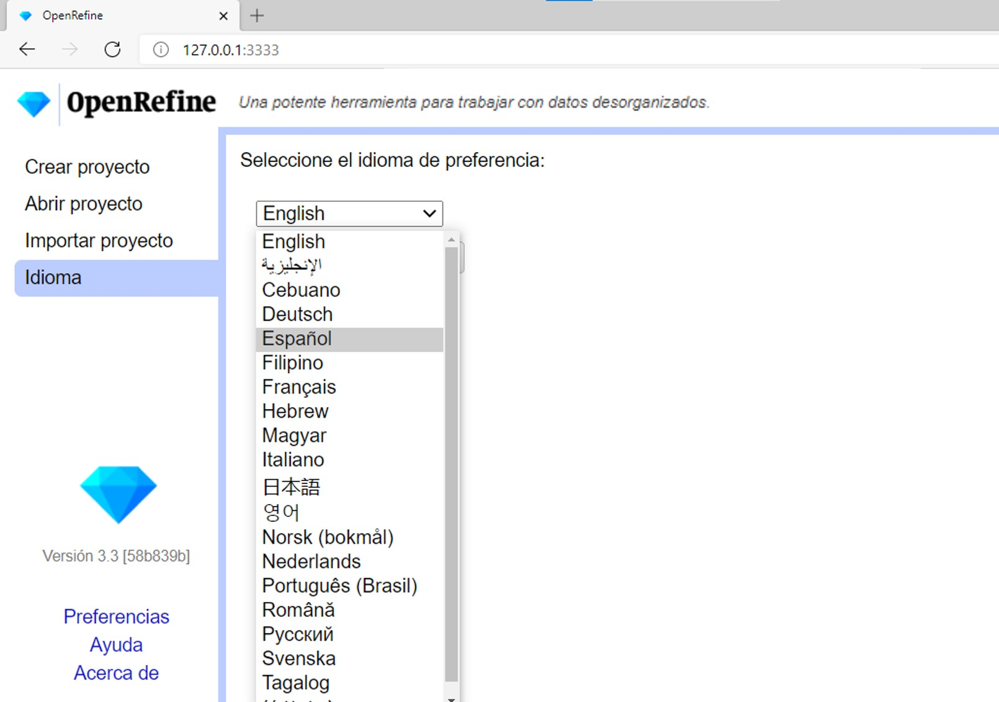

== Carga de datos y creación de un proyecto

Para comenzar a utilizar OpenRefine debe cargar sus datos en el programa y crear un proyecto. Para ello, siga los siguientes pasos:

****
[discrete]
=== Paso 1

*Abra la aplicación OpenRefine*. Si utiliza Windows, se abrirá una ventana de comandos que mostrará las acciones que OpenRefine está realizando (<>). No cierre esta ventana mientras esté trabajando con el programa.

[#img-fig-01]
.Figura 1
image::img/es.figure-01.png[align=center]

OpenRefine se abrirá en el navegador que usted utilice por defecto inmediatamente después de ejecutar la aplicación (<>). Si OpenRefine no abre, puede acceder manualmente ingresando la siguiente URL en su navegador:
--
http://127.0.0.1:3333
--

[#img-fig-02]
.Figura 2

En el menú de la izquierda tiene opciones para crear, abrir o importar proyectos. Si usted no tiene ningún proyecto aún, en la opción de “Abrir proyecto” verá una lista vacía. 

Además puede cambiar la configuración de idioma. Para ello, haga click en “Idioma” y en la siguiente pantalla (<>) seleccione el idioma preferido. Acepte los cambios. En esta guía se utilizará el idioma Español.

[#img-fig-03]
.Figura 3

****

****
[discrete]
=== Paso 2

*Cargue los datos* (<>). Dentro de la opción “Crear proyecto”, escoja el archivo que desea cargar. Note que hay varios formatos posibles de archivos que se pueden subir (tsv, csv, xls, json, etc). Haga click en “Siguiente”. 

Para seguir esta guía, cargue el archivo proporcionado, al que puede acceder a través del enlace provisto en la sección Comentarios Preliminares.

NOTE: Si sube archivos con formato .xls o .xlsx, tenga en cuenta que no podrá modificar la codificación, y que pueden encontrarse algunos errores en los datos (ejemplo: los tildes en las palabras se verán como símbolos raros cuando cargue los datos). Para evitarse problemas, si trabaja con Excel es conveniente que exporte los datos como archivo .csv (de todas formas, tenga cuidado con la codificación, ver más abajo).

Verá entonces una pantalla como la que se muestra en la <>. Allí puede ver una muestra de sus datos, dar nombre a su proyecto, y puede modificar varios aspectos de la carga de los datos al programa: codificación, criterio para la separación en columnas, inclusión o no de la primera fila, etc.

OpenRefine sugiere algunas de las codificaciones más utilizadas cuando se hace click en el cuadro de texto “Codificación de caracteres”. Asegúrese de escoger correctamente la codificación. Si está utilizando el conjunto de datos de prueba proporcionado, escoja UTF-8 (<>).

OpenRefine presenta la opción de “Detectar y transformar texto en números, fechas, …”. Si esta opción es seleccionada, el programa tratará de interpretar ciertos campos transformándolos a determinados formatos. Por ejemplo, si detecta campos de fecha, tratará de colocar los valores de las celdas de ese campo en formato de fecha estándar. Dada la naturaleza de los datos sobre biodiversidad con los que solemos trabajar, estas interpretaciones pueden ser incorrectas e introducir más errores. Asegúrese entonces de desmarque esta opción durante el paso de importación de datos.

[#img-fig-04]
.Figura 4

[#img-fig-05]
.Figura 5
image::img/es.figure-05.jpg[Figura 5,align=center]

****

****
[discrete]
=== Paso 3

*Cree el proyecto*. Una vez que haya seleccionado las opciones de carga de datos, haga click en el botón “Crear Proyecto” arriba a la derecha.

****

****
[discrete]
=== Paso 4

*¡Felicitaciones!* Ya tiene un proyecto (lo verá como en la <>).

[#img-fig-06]
.Figura 6

NOTE: el número de líneas cargadas se muestra en este momento arriba de la tabla, aunque el número de filas mostradas en la tabla sea limitado. No desespere, OpenRefine sólo muestra hasta 50 líneas, pero las acciones que uno pueda tomar en la aplicación pueden tener efecto sobre filas aunque éstas no sean mostradas.

****

<<<
