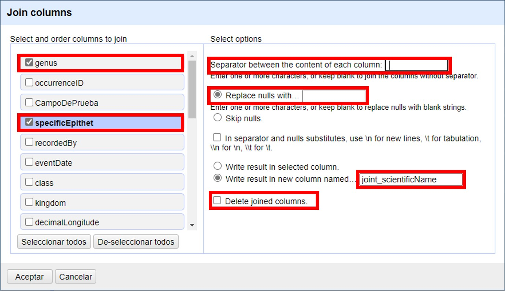
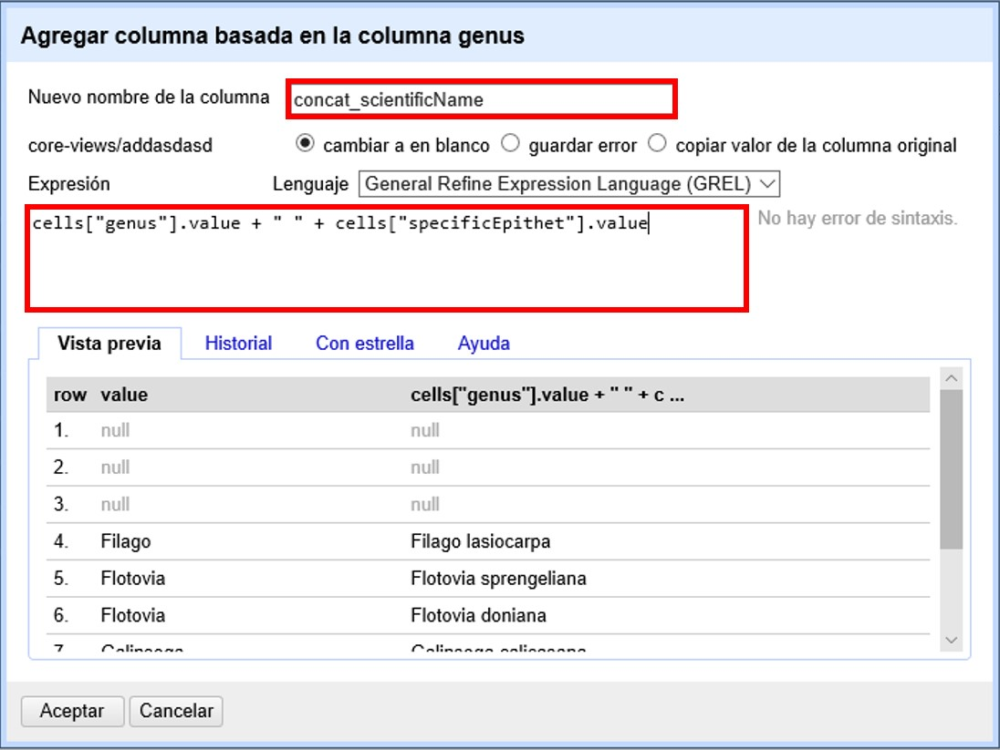

== Limpieza de datos 

=== Manejo básico de columnas

==== Renombrar, eliminar y mover columnas

Veamos primero algunas funciones básicas que se pueden aplicar sobre los campos:

1. *Renombrar un campo.*
+
Hacer click en "la &#9660; azul del campo > Editar columnas > Renombrar esta columna"

2. *Eliminar un campo.*
+
Hacer click en "la &#9660; azul del campo > Editar columnas > Eliminar esta columna"

3. *Mover un campo.*
+
Hacer click en 
+
… "la &#9660; azul del campo > Editar columnas > Mover columna al principio"
+
… "la &#9660; azul del campo > Editar columnas > Mover columna al final"
+
… "la &#9660; azul del campo > Editar columnas > Mover columna a la izquierda"
+
… "la &#9660; azul del campo > Editar columnas > Mover columna a la derecha"
+
Estas tres opciones pueden verse en la <>.
+
[#img-fig-08]
.Figura 8
image::img/es.figure-08.jpg[Figura 8,width=375,align=center]

4. *Reordenar o eliminar varios campos a la vez.*
+
Para esta función se utiliza el campo “Todo”, que se encuentra como primera columna de la tabla. Este campo no forma parte de los datos originales, es agregado por el programa para permitir llevar a cabo ciertas funciones. 
+
Hacer click en "la &#9660; azul en el campo “Todo” > Editar columnas > Ordenar / Eliminar columnas…" (<>).
+
Se abrirá entonces una ventana como la que se muestra en la <>. Allí puede ordenar los campos simplemente arrastrándolos arriba o abajo en la lista, y eliminarlos arrastrándolos hacia la parte derecha de la ventana. Una vez que termine de modificar el orden de los campos, haga click en “Aceptar”.
+
[#img-fig-09]
.Figura 9
image::img/es.figure-09.jpg[Figura 9,width=911,align=center]

En OpenRefine se considera que cualquiera de los cuatro cambios descriptos anteriormente son cambios a los datos, y por ende se registran como tales en el historial de cambios (ver más abajo sección <<sect-2.5,Deshacer y rehacer cambios>>).

==== Nuevas columnas vacías

Se pueden crear nuevos campos en base a cero, uno o más campos preexistentes.

Para crear un nuevo campo de cero, sobre cualquier columna preexistente siga la ruta: 

"Editar columnas > Agregar columna basada en esta columna…"

Se abrirá una ventana como la que se muestra en la <>.

Arriba de todo, coloque el nombre del nuevo campo.

IMPORTANT: Debe tener extremo cuidado al escoger los nombres que dará a las nuevas columnas. Considere que el nombre sea indicativo de lo que contiene (e.g., no utilice nombres tales como “Columna 1” o “Transformación 3”). OpenRefine no le dejará utilizar nombres que ya hayan sido utilizados para nombrar otros campos dentro del proyecto. Considere qué otros campos tiene en su base de datos original y no utilice nombres que ya hayan sido utilizados, se evitará así importar datos a columnas equivocadas al volver a su base de datos.

Luego, en el cuadro de texto “Expresión” escriba: [source]`null`. Ello quiere decir que se creará un campo con valores nulos. Luego oprima “Aceptar”. Alternativamente, en vez de [source]`null` puede colocar la expresión: [source]`""`, y el nuevo campo tendrá valores en blanco.

[#img-fig-10]
.Figura 10
image::img/es.figure-10.jpg[Figura 10,width=548,align=center]

El nuevo campo, con el nombre que le haya dado, aparecerá a la derecha de aquel a partir del cual fue generado.

IMPORTANT: Tenga en cuenta que las columnas nuevas que cree en la aplicación no estarán en su base de datos original. Al importar los datos que han sido limpiados de regreso a su base de datos, dependiendo de cómo esté estructurada esa base de datos, es posible que estas nuevas columnas no sean importadas o que reciba un mensaje de error de importación porque el número de campos del archivo no coincide con el de la base de datos. En estos casos, debe asegurarse de agregar previamente los nuevos campos en su base de datos si desea importar todos los campos nuevos.

==== Nuevas columnas a partir transformaciones simples de otras columnas

Muchas veces no queremos modificar los datos directamente en los campos (columnas) en que se presentan, dado que queremos mantener los valores originales y/o queremos proveer información adicional basada en ciertos campos. Por ejemplo, podríamos tener como campos individuales el género y el epíteto específico y queremos agregar el campo nombre científico como concatenación de los dos; o viceversa: tenemos un único campo nombre científico y queremos mantener ese campo y proveer otros dos campos adicionales para género y epíteto, a partir de la división del anterior. Para estos casos es útil crear nuevos campos en nuevas columnas.

Veamos ahora cómo crear nuevas columnas con datos modificados a partir de columnas preexistentes.

===== Concatenaciones

Si desea crear un campo que sea la concatenación de otros dos campos separados puede seguir dos rutas, que se describen a continuación, de acuerdo a la versión del programa que utilice. La primera ruta utiliza la función “Unir columnas” (o “Join columns”, como figura en el programa), y está disponible en la versión 3.3 y posteriores de OpenRefine. Las versiones anteriores del programa no tienen esta función, pero el mismo resultado puede obtenerse siguiendo la segunda ruta descripta abajo utilizando cualquier versión del programa. Para ambas rutas utilizaremos como ejemplo la concatenación de los campos [source]`"genus"` y [source]`"specificEpithet"`.

*Ruta 1: Función “Unir columnas”*

Click en menu:la{sp}&#9660;{sp}azul{sp}del{sp}campo{sp}{genus}[Editar columnas > Join columns…]
(Notar que el nombre de la función y los menúes que se despliegan están en inglés en esta versión del programa).

Se abrirá una nueva ventana (<>), donde puede seleccionar todas las columnas que desea unir.

El primer recuadro a la derecha le permite seleccionar qué separador utilizar entre los contenido de cada columna. Por ejemplo, puede utilizar un espacio " ". 
Luego debe especificar qué hacer con los registros donde alguno de los campos a unir tiene valores nulos (por ejemplo, [source]`"genus"` tiene un valor pero [source]`"specificEpithet"` es nulo, o viceversa). Si elige la opción "Replace nulls with..." ("Reemplazar nulos con…"), puede especificar con qué reemplazar esos valores nulos (por ejemplo, algún caracter), o dejar ese recuadro vacío. Si, en cambio, escoge "Skip nulls" ("Saltear nulos"), para todos aquellos registros que tuvieran uno de los dos campos nulos no se llevará a cabo la unión.

IMPORTANT: Nota: Al escoger reemplazar los valores nulos y dejar el cuadro vacío (es decir, reemplazar por un caracter nulo), aún se hará la unión utilizando el separador indicado. Si el primer campo a unir tiene un valor no nulo y el segundo un valor nulo, el resultado será el valor del primer campo más el separador. Si el primer campo a unir tiene un valor nulo y el segundo un valor no nulo, el resultado será sólo el valor del segundo campo (sin separador). Para un ejemplo práctico, ver <<#table-join, Tabla 1>> más abajo.

Luego debe indicar si quiere los resultados sobre la misma columna sobre la que está actuando o en una columna nueva, y en ese caso, proveer un nombre para el nuevo campo. Puede llamar al nuevo campo "joint_scientificName", para indicar que se trata de la unión (note que ya hay un campo [source]`"scientificName"` en los datos). Siempre es recomendable crear un nuevo campo, y en todo caso eliminar los campos innecesarios luego.

Por último, tiene la opción de eliminar las columnas que dieron origen a la unión ("Delete joined columns", "Eliminar columnas unidas"). Si desea conservarlas, como en este caso, asegúrese de que esa opción está desmarcada.

[#img-fig-11]
.Figura 11

Los resultados esperados de acuerdo a distintos parámetros escogidos se resumen en la siguiente tabla (<<#table-join, Tabla 1>>):

[#table-join]
Tabla 1. Ejemplos de unión de dos columnas (“genus” y “specificEpithet”) en otra (“joint_scientificName), utilizando distintos separadores y tratamientos de nulos.

[cols=5,options="header"]
|===

|Separador
|Tratamiento de nulos
|genus
|specificEpithet
|joint_scientificName
.12+.^|" " 
(un espacio)
.4+.^|Reemplazar nulos con: "" 

(sin especificar)
|Filago
|lasiocarpa
|Filago lasiocarpa
|Filago
|_null_
|Filago 

_(con un espacio extra después del género)_
|_null_
|lasiocarpa
|lasiocarpa
|_null_
|_null_
|_null_
.4+.^|Reemplazar nulos con: "@"
|Filago
|lasiocarpa
|Filago lasiocarpa
|Filago
|_null_
|Filago @
|_null_
|lasiocarpa
|@ lasiocarpa
|_null_
|_null_
|@ @
.4+.^|Saltear nulos
|Filago
|lasiocarpa
|Filago lasiocarpa
|Filago
|_null_
|_null_
|_null_
|lasiocarpa
|_null_
|_null_
|_null_
|_null_
.12+.^|", " 

(coma y espacio)
.4+.^|Reemplazar nulos con: "" 

(sin especificar)
|Filago
|lasiocarpa
|Filago, lasiocarpa
|Filago
|_null_
|Filago, 

_(con un espacio extra después de la coma)_
|_null_
|lasiocarpa
|lasiocarpa
|_null_
|_null_
|_null_
.4+.^|Reemplazar nulos con: "@"
|Filago
|lasiocarpa
|Filago, lasiocarpa
|Filago
|_null_
|Filago, @
|_null_
|lasiocarpa
|@, lasiocarpa
|_null_
|_null_
|@, @
.4+.^|Saltear nulos
|Filago
|lasiocarpa
|Filago, lasiocarpa
|Filago
|_null_
|_null_
|_null_
|lasiocarpa
|_null_
|_null_
|_null_
|_null_
|===

Si optamos por una opción que contiene en los resultados espacios en blanco no deseados, podemos aplicar luego una transformación en las celdas de la columna resultado del tipo "Quitar espacios al inicio y al final" (ver <<#Facetas-y-espacios-en-blanco, sección 2.2.2>>).

*Ruta 2: Concatenación mediante expresiones regulares*

Click en menu:la{sp}&#9660;{sp}azul{sp}del{sp}campo{sp}{genus}[Editar columnas > Agregar columna basada en esta columna…]

Se abrirá una nueva ventana (<>). Puede llamar al nuevo campo “concat_scientificName”, para indicar que se trata de la concatenación (note que ya hay un campo [source]`"scientificName"` en los datos).

En el cuadro de texto, pegue la siguiente expresión:

Expresión ejemplo:	[source]`cells["genus"].value + " " + cells["specificEpithet"].value` _(Expresión 1)_ +
Expresión general:	[source]`cells["campo1"].value + " " + cells["campo2"].value`

La expresión ejemplo concatena (`+`) los valores del campo [source]`"genus"` ([source]`cells["genus"].value`) y los del campo [source]`"specificEpithet"` ([source]`cells["specificEpithet"].value`), con un espacio entre los valores ("[source]`` ``").

[#img-fig-12]
.Figura 12

Note que esta expresión funciona cuando ambos campos, [source]`"genus"` y [source]`"specificEpithet"`, tienen valores, es decir no son nulos. Si alguno de los dos campos tiene valores nulos, entonces no se lleva a cabo la concatenación. Por ejemplo, si hay un valor para genus pero specificEpithet está vacío, el campo de concatenación aparecerá vacío. Esto se debe a que no se puede operar sobre valores nulos.

En este caso, puede sortear el problema utilizando en cambio la siguiente expresión:

[source,javascript]
----
if(isBlank(cells["genus"].value), "", cells["genus"].value) + " " + if(isBlank(cells["specificEpithet"].value), "", cells["specificEpithet"].value)
----
_(Expresión 2)_

Lo que dicha expresión significa es: concatenar ([source]`+`) dos partes, cada una proviene de una sub-expresión [source]`if`, separadas por un espacio ([source]`+ " " +`). Cada una de estas sub-expresiones indica: si ([source]`if`) el valor del campo dado es nulo ([source]`isBlank(cells["genus"].value)`), colocar un blanco  ([source]`""`), si no ([source]`,`), colocar el valor del campo ([source]`cells["genus"].value`). La otra sub-expresión es lo mismo pero para epíteto específico.

NOTE: Para evitar de modo más general este problema de celdas nulas, cuando importa el conjunto de datos para crear su proyecto al principio del proceso, puede asegurarse de NO seleccionar la opción “Store blank cells as nulls” (ver <>).

La fórmula anterior (Expresión 2) resuelve el problema de tener valores nulos en la concatenación, pero al aplicarla, si alguno de los campos es nulo, el resultado tendrá espacios en blanco extra no deseados. Por ejemplo, si el valor de [source]`"genus"` es nulo, el valor resultante en el campo concatenado será " epíteto", con un espacio en blanco antes del epíteto; si el valor de [source]`"specificEpithet"` es nulo, el valor resultante será "genus ", con un espacio en blanco después del género; y si los valores de ambos son campos son nulos, el valor resultante será " ", un espacio en blanco. 
Para resolver este problema, se puede: 1) aplicar una transformación en las celdas de la columna resultado del tipo "Quitar espacios al inicio y al final" (ver <<#Facetas-y-espacios-en-blanco, sección 2.2.2>>), o 2) incluir en la expresión la quita de espacios al inicio y al final. Siguiendo la segunda opción, la expresión final sería:

[source,javascript]
----
Trim(if(isBlank(cells["genus"].value), "", cells["genus"].value) + " " + if(isBlank(cells["specificEpithet"].value), "", cells["specificEpithet"].value))
----
_(Expresión 3)_
donde se ha aplicado la función "Trim", que quita espacios en blanco no deseados al inicio y al final del valor de las celdas.

Los resultados esperados utilizando cada una de las tres fórmulas se resumen en la siguiente tabla (<<#table-concat, Tabla 2>>):

[#table-concat]
Tabla 2. Ejemplos de concatenación de dos columnas (“genus” y “specificEpithet”) en otra (“concat_scientificName), utilizando distintas expresiones (ver texto más arriba).

[cols=4,options="header"]
|===
|Expresión
|genus
|specificEpithet
|concat_scientificName
.4+.^|1
|Filago
|lasiocarpa
|Filago lasiocarpa
|Filago
|_null_
|_null_
|_null_
|lasiocarpa
|_null_
|_null_
|_null_
|_null_
.4+.^|2
|Filago
|lasiocarpa
|Filago lasiocarpa
|Filago
|_null_
|Filago 

_(con un espacio en blanco después del género)_
|_null_
|lasiocarpa
| lasiocarpa

_(con un espacio en blanco antes del epíteto)_
|_null_
|_null_
| 

_(con un espacio en blanco)_
.4+.^|3
|Filago
|lasiocarpa
|Filago lasiocarpa
|Filago
|_null_
|Filago 
|_null_
|lasiocarpa
|lasiocarpa
|_null_
|_null_
|_null_
|===

[#División-de-columnas]
===== Divisiones
Si desea crear campos separados a partir de los valores en un único campo, siga la siguiente ruta:

Utilizaremos como ejemplo la división del campo [source]`"eventDate"` para agregar tres campos: año, mes y día (year, month y day)

Click en menu:la{sp}&#9660;{sp}azul{sp}del{sp}campo{sp}{eventDate}[Editar columnas > Dividir en varias columnas…]

Se abrirá una nueva ventana (<>). Allí debe escoger si se dividirá por separador o por longitud de caracteres, y en el primer caso qué tipo de separador se utilizará (puede ser espacio, caracter de tabulación, coma, punto y coma, guión, etc.).

En este caso, si exploramos los datos del campo original veremos que año, mes y día están separados por barras oblicuas (“/”), de modo que elegiremos esta barra como separador.

IMPORTANT: *Desmarque la opción “Eliminar esta columna” a la derecha*. Si la deja seleccionada, perderá el campo original y sólo tendrá los tres nuevos campos.

[#img-fig-13]
.Figura 13

Una vez que oprima Aceptar, se crearán las nuevas columnas a la derecha del campo [source]`"eventDate"`. OpenRefine las nombra automáticamente agregando números al final del nombre (en este caso: eventDate1, eventDate2 y eventDate3). Cambie los nombres de las columnas por los que corresponda ("la &#9660; azul > Editar columnas > Renombrar esta columna"). En este caso, nómbrelos “year”, “month” y “day” según corresponda.

[IMPORTANT]
====
Cuando efectúe este tipo de divisiones de campos utilizando como criterio ya sea separadores o longitud de caracteres, asegúrese de que en el campo original no haya distintos formatos para diferentes registros. Vea el siguiente ejemplo:

Se quiere separar un campo nombrado “coordenadas” que contiene datos de latitud y longitud separados por coma, del tipo: “-32.04588990, -54.98789901”, para obtener dos campos distintos, latitud y longitud. 

Si todos los campos tienen el mismo formato, obtendrá dos campos nuevos de la siguiente forma:
[source,notjavascript]
----
campo 1: -32.04588990
campo 2: -54.98789901
----

En cambio, si en algún registro los valores dentro del campo coordenadas no están en formato decimal, entonces tendrá problemas al dividir el campo. Suponga como ejemplo que uno o más registros tienen valores con formato “34° 20’ 15,2’’ S, 54° 49’ 13’’ O”. En ese caso, la separación le dará 3 campos en vez de dos, con la latitud incorrectamente separada:

[source,notjavascript]
----
campo 1: 34° 20’ 15
campo 2: 2’’ S
campo 3: 54° 49´ 13´´ O
----
====
