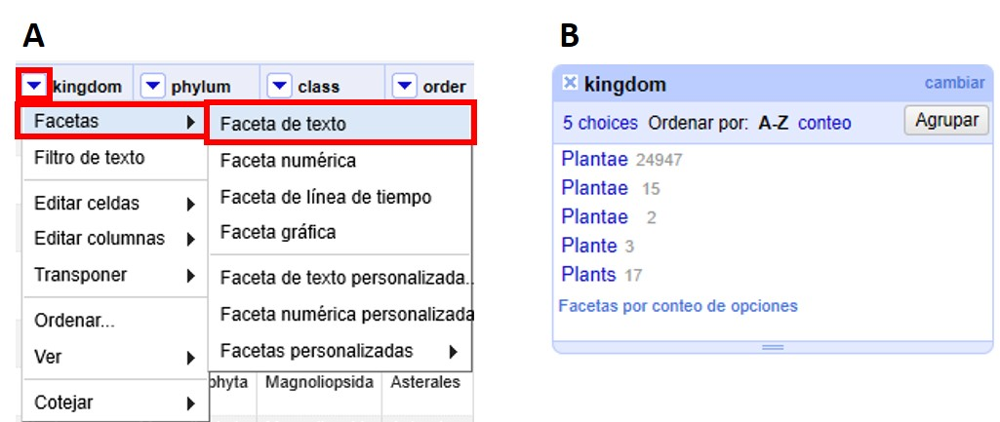
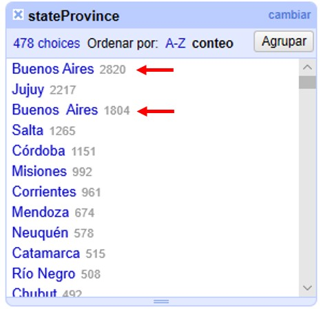
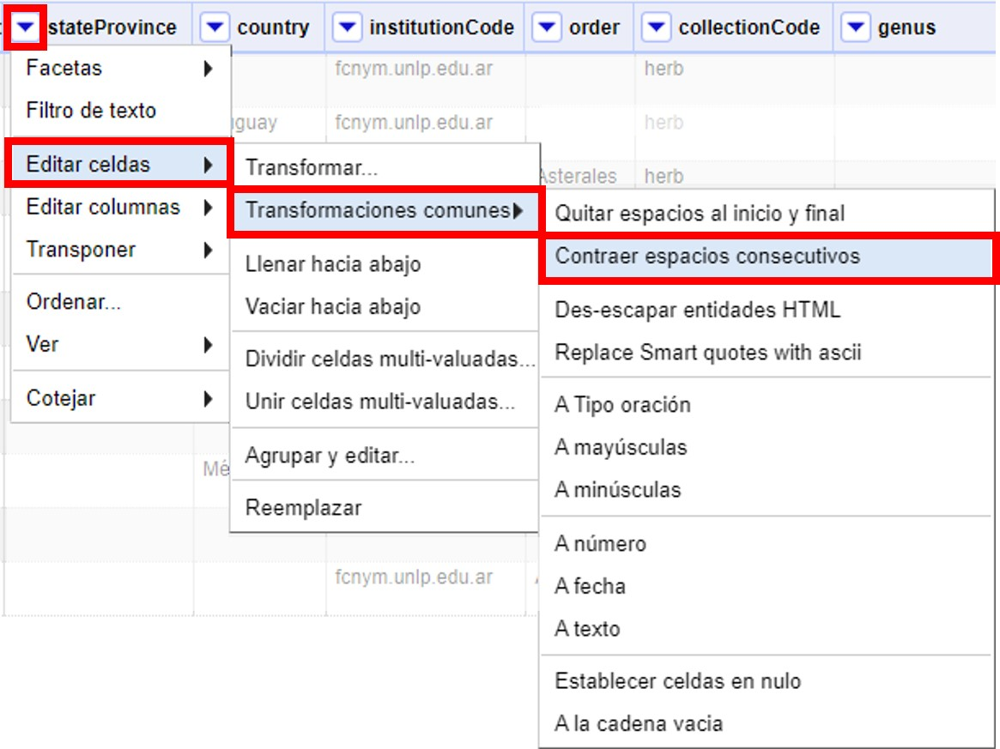
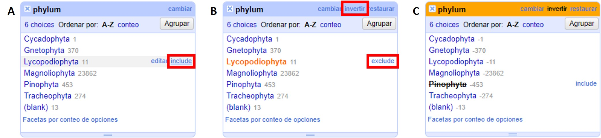
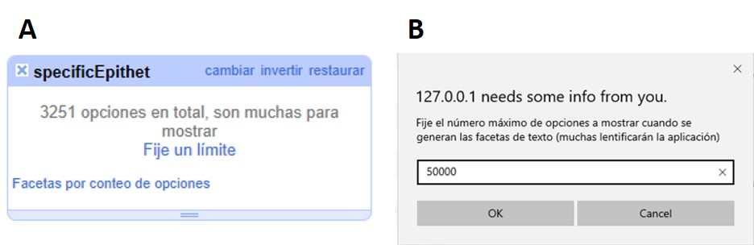

=== Uso de Facetas

La función “Facetas” es una forma de visualización de los datos, que permite el tratamiento en bloque de grupos de registros. Las facetas se pueden aplicar a celdas que contengan cualquier tipo de texto, números o fechas.

==== Facetas de texto

Ubique la columna [source]`"kingdom"` y haga click sobre menu:la{sp}&#9660;{sp}azul[]. Dentro de “Facetas”, escoja “Faceta de texto”, como se muestra a continuación (<>). Se abrirá entonces a la izquierda una ventana con la faceta (<>).

[#img-fig-14]
.Figura 14

En dicha ventana de faceta, puede ordenar los valores alfabéticamente (haciendo click sobre “A-Z”) o según el número de registros asociados a cada valor (haciendo click sobre “conteo”).

En la lista de valores podemos ver que hay algunos errores. Para corregirlos coloque el cursor sobre el valor que desea modificar y haga click en “editar”. Se abrirá entonces una pequeña ventana donde puede cambiar el valor (<>).  Para guardar el cambio haga click en “Aplicar”, ello aplicará el cambio a todos aquellos registros que tenían el valor dado. 

Corrija los valores “Plante” y “Plants”. Cuando lo haga, habrá corregido todos los registros que contenían esos valores, y se modificará entonces el número de registros que tiene el valor “Plantae”.

[#img-fig-15]
.Figura 15

[#Facetas-y-espacios-en-blanco]
==== Facetas y espacios en blanco

===== Espacios en blanco extra al principio o al final de una cadena de texto

Una vez que haya corregido los valores en el punto anterior, notará que aún aparecen 3 valores “Plantae”, aparentemente iguales (<>). Sin embargo, estos valores sí son diferentes: tienen espacios adicionales al final del valor de texto. 

[#img-fig-16]
.Figura 16
image::img/es.figure-16.jpg[Figura 16,align=center]

Para corregir estos errores, asegúrese de que ninguno de los valores en la faceta están seleccionados y de que el número de registros que se muestra arriba de la tabla es el total (24984). Sobre la columna [source]`"kingdom"`, haga click sobre menu:la{sp}&#9660;{sp}azul[] y siga las siguientes opciones (<>):

--
"Editar celdas > Transformaciones comunes > Quitar espacios al inicio y final"
--

Esta función permite eliminar espacios en blanco que puedan aparecer al principio y al final de cadenas de texto. Cuando termine este paso, los 24,984 registros deberían tener el valor “Plantae” en la columna [source]`"kingdom"`.

[#img-fig-17]
.Figura 17

===== Espacios en blanco extra entre palabras en una cadena de texto

A veces en campos que contienen cadenas de texto con varias palabras puede haber espacios en blanco extra entre palabras. Para ver un ejemplo, ubique la columna [source]`"stateProvince"` en el conjunto de datos. Arme una faceta de texto para dicha columna (click sobre "la &#9660; azul > Facetas > Faceta de texto"). Luego, en la faceta, ordene los valores por número de registros asociados (seleccionando “conteo”). Verá entonces los valores que se encuentran en este campo como se muestra en la <>.

Note que en primer y tercer lugar figura aparentemente el mismo valor, “Buenos Aires”. La diferencia entre ambos valores es que uno de ellos tiene un doble espacio entre las palabras.

[#img-fig-18]
.Figura 18

Para corregir este error, sobre la columna [source]`"stateProvince"`, haga click sobre menu:la{sp}&#9660;{sp}azul[] y siga la siguiente ruta (<>):

--
"Editar celdas > Transformaciones Comunes > Contraer espacios consecutivos"
--

Esta función le permite convertir múltiples espacios en blanco en un único espacio en blanco.

[#img-fig-19]
.Figura 19

Una vez que haya removido los espacios en blanco extra, en la faceta sólo verá un valor para “Buenos Aires”, con un número de registros que es la suma de los valores anteriores. Tenga en cuenta que si había otros valores con el mismo problema de dobles espacios entre palabras en esta misma columna, la modificación se aplicará a todos ellos, y no sólo a “Buenos Aires”. Puede comprobar cuántos valores se han modificado comparando el número de valores disponibles en la faceta antes y después de la transformación.

===== Espacios en blanco extra en todo el conjunto de datos

Habiendo visto cómo eliminar espacios en blanco extra, al principio, final o en medio de una cadena de texto, en campos determinados, existe una manera de realizar todas estas acciones al mismo tiempo sobre todos los campos de conjunto de datos. 
Para ello, se debe ir a la columna “Todo”, hacer click sobre "la &#9660; azul > Transformar. 

Se abrirá entonces una ventana, y en el cuadro de texto debe pegarse la siguiente expresión:
[source,javascript]
----
value.trim().replace(/\s+/,' ') 
----

Al hacer click en “Aceptar” se eliminarán los espacios en blanco extra en todo el conjunto de datos. Los cambios serán registrados columna a columna en el historial de cambios (ver más abajo sección <<sect-2.5,Deshacer y rehacer cambios>>).

==== Inclusión y exclusión de registros usando facetas

===== Inclusión de registros con valores determinados para un campo dado

Las facetas pueden utilizarse para trabajar sobre registros con uno o más valores de interés en un campo en cuestión. 
Para trabajar sobre un ejemplo, arme una faceta de texto sobre el campo [source]`"phylum"` (click sobre "la &#9660; azul > Facetas > Faceta de texto"). Verá que la faceta tiene varios valores. 
Para seleccionar solo los registros que tienen como phylum, por ejemplo, “Lycopodiophyta”, debe hacer click sobre el valor mismo dentro de la faceta o sobre la opción “include” que se muestra a su derecha (<>).

[#img-fig-20]
.Figura 20

IMPORTANT: Al seleccionar un valor dentro de una faceta, cualquier acción que tome a continuación sólo será aplicada a los registros incluidos bajo esa selección. 

Puede seleccionar tantos valores como desee dentro de una faceta, utilizando “include” sucesivamente sobre cada uno de ellos.

===== Exclusión de registros con valores determinados para un campo dado

Para deseleccionar registros previamente seleccionados a través de una faceta, simplemente haga click sobre el valor nuevamente, o sobre la opción “exclude” que se muestra a su derecha (<>). Puede deseleccionar tantos valores como desee utilizando “exclude” sucesivamente sobre cada uno de ellos.

En ocasiones las facetas pueden contener muchos valores de interés diferentes sobre los que quisiéramos trabajar. En estos casos, puede ser muy engorroso seleccionar todos los valores de interés uno a uno. En cambio, se puede utilizar la función “invertir” selección. Para aplicar esta función, deben seleccionarse los valores que _no_ son de interés. Una vez seleccionados, en la parte superior de la faceta aparece la opción “invertir” (<>). Haciendo click el programa nos brindará la selección inversa, incluyendo entonces los valores que _sí_ nos interesan.

Por ejemplo, para el campo [source]`"phylum"` del ejemplo anterior, nos interesan todos los valores menos “Pinophyta”. Seleccionamos entonces “Pinophyta” haciendo click en “include” para este valor. Luego hacemos click en “invertir”, y como resultado habremos seleccionado todos los registros salvo aquellos que tienen el valor “Pinophyta” (<>).

Para revertir la inversión puede hacerse click en “invertir” nuevamente, volviendo entonces a los valores seleccionados inicialmente.

===== Selección de registros sin valores para un campo dado

En muchas ocasiones resulta muy útil poder identificar los registros que tienen un campo de interés vacío, sin valores. Utilizando facetas se pueden reconocer esos registros fácilmente, pues figuran dentro de la faceta con valor “(blank)” (ver por ejemplo este valor en la faceta compuesta para el apartado anterior, sobre el campo [source]`"phylum"`, <>) . 
El valor “(blank)” se puede tratar como cualquier otro dentro de la faceta, es decir, se puede incluir, excluir, y editar, facilitando la evaluación y el mejoramiento de los registros.

==== Facetas numéricas

Las facetas también pueden aplicarse a campos numéricos, y en ese caso son muy útiles para, por ejemplo, detectar valores fuera de rangos de interés.

A modo de ejemplo, armaremos una faceta numérica sobre el campo [source]`"day"` que hemos creado más arriba. Para ello, hacer click en menu:la{sp}&#9660;{sp}azul[] del campo y seguir la ruta:

--
"Facetas > Faceta numérica"
--

Verá entonces una nueva ventana, la faceta, como se muestra en la <>.

[#img-fig-21]
.Figura 21

Allí se puede ver que el rango de días abarca desde 1 a 35 inclusive. Es decir, algunos números están fuera de rango, puesto que como máximo puede haber hasta día 31 en algunos meses.

Se pueden seleccionar los registros con los valores superiores desplazando el botón a la izquierda del rango hacia la derecha. Ello incluirá en la tabla los registros por encima del rango seleccionado y, si no desmarca la opción “Blank”, también los blancos, como se muestra en la <> (en el ejemplo, tres filas en total: un caso con día 32, un caso con día 35 y un caso con día vacío). Si hubiera valores en el campo que no son numéricos, también podría verlos utilizando esta faceta.

[#img-fig-22]
.Figura 22

Los tres errores encontrados deben ser consultados con la información original de los ejemplares en la colección, y los campos de fecha estrictamente deberían quedar vacíos para estos registros. Una opción es marcar estos registros para revisar más adelante, usando estrellas o banderas (ver sección sobre uso de estrellas y banderas).

IMPORTANT: Si el campo sobre el que desea armar la faceta no es un campo con formato numérico (e.g., tiene formato texto, o fecha, etc.), la faceta numérica no le mostrará valores. En cambio, dirá que el campo no tenía valores numéricos (“No numeric value present.”). Para poder armar una faceta numérica tendrá entonces primero que transformar los datos de la columna de interés a formato numérico. Para ello, siga la ruta: click sobre "la &#9660; azul del campo > Editar celdas > Transformaciones comunes > A número".

==== Facetas y duplicados

Las facetas también permiten la detección y corrección de duplicados. 

NOTE: Cuando hablamos aquí de duplicados, nos referimos a valores duplicados dentro de una columna, no necesariamente a registros enteros duplicados, o a duplicados en el sentido biológico/de colecciones. Por ello, tenga especial cuidado a la hora de actuar sobre estos valores duplicados, pues podrían tener efectos a diferentes niveles.

Veremos un ejemplo de duplicados en la columna [source]`"catalogNumber"`. Para ello, haga click en menu:la{sp}&#9660;{sp}azul[] y luego siga la siguiente ruta:

--
"Facetas > Facetas personalizadas > Faceta por duplicados"
--

Verá entonces una ventana con la faceta, como se muestra en la <>, donde “true” (“verdadero”) refiere a los valores duplicados.

[#img-fig-23]
.Figura 23
image::img/es.figure-23.jpg[Figura 23,align=center]

Si hace click en “true”, la pantalla principal le mostrará los registros que tienen número de catálogo duplicado (<>). Observe por ejemplo los siguientes registros:

* el primer y quinto registros tienen el mismo número de catálogo, 5567
* el tercer registro (y otros más abajo que no son visibles entre los 25 primeros) no tiene número de catálogo (el valor nulo es lo que está duplicado).
* etc.

[#img-fig-24]
.Figura 24

Corrija los números de catálogo. Para hacerlo, edite las celdas individualmente: sobre la celda haga click en el botón “editar”, modifique el valor y haga click en “Aplicar” (<>). 

NOTE: En la práctica la corrección de los números de catálogo sólo debe hacerse una vez que los números y los datos asociados han sido comprobados con las etiquetas de los especímenes.

[#img-fig-25]
.Figura 25
image::img/es.figure-25.jpg[Figura 25,align=center]

==== Límite en el número de opciones de las Facetas

En OpenRefine existe un límite para el número de elecciones de faceta que se muestran (“choices”). Muchas veces dicho número está pre-configurado a un valor de 2000. Ello quiere decir que sólo podrá ver 2000 opciones dentro de la faceta de interés.

Por ejemplo, si tiene configurado el valor a 2000 y trata de armar una faceta de texto en el campo [source]`"specificEpithet"`, verá que a la derecha la faceta no muestra los valores esperados sino un mensaje que dice que hay demasiados valores para mostrar (<>).

[#img-fig-26]
.Figura 26

Haciendo click en “Fije un límite”, se abrirá otra ventana donde puede cambiar el límite al valor preferido (<>).

Una vez que haya cambiado el valor límite, y si este valor es lo suficientemente grande, podrá ver todos los valores en la faceta del campo de interés (en el ejemplo anterior, el campo [source]`"specificEpithet"`).

Alternativamente, para modificar en cualquier momento el límite en el número de valores que se pueden desplegar por faceta, puede ir a la siguiente dirección en su navegador web:
--
http://127.0.0.1:3333/preferences
--

El navegador mostrará una ventana con ciertas opciones (<>). Allí, establezca el límite preferido para las facetas editando la clave “ui.browsing.listFacet.limit”. Para ello haga click en “core-index/edit”, y en la ventana que se abre, coloque el nuevo valor límite y oprima “OK” (<>).

[#img-fig-27]
.Figura 27
image::img/es.figure-27.jpg[Figura 27,align=center]
