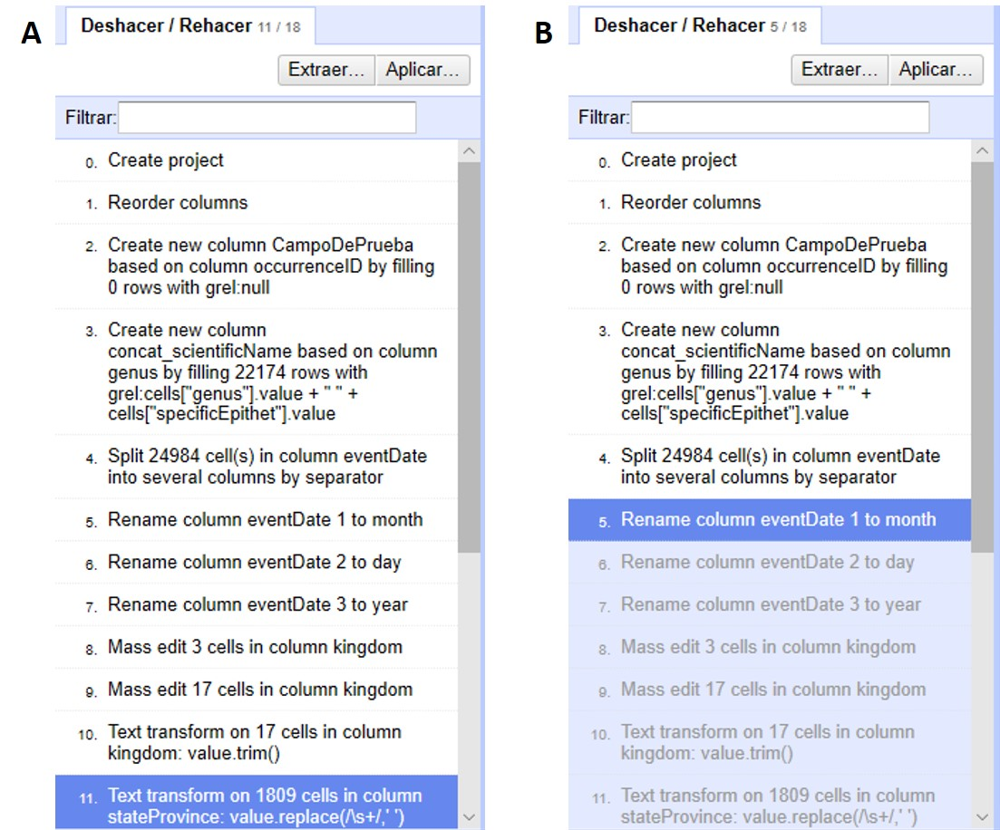

[[sect-2.5]]
=== Deshacer y rehacer cambios

Ahora que ya ha acumulado una serie de modificaciones al conjunto de datos, veamos cómo se pueden deshacer y rehacer cambios.

En el menú de arriba a la izquierda, abra la pestaña “Deshacer/Rehacer”, que está asociada a un número que indica el número de cambios acumulados hasta ahora. Verá entonces una lista de pasos realizados, como se muestra en la <>.

Note que el paso resaltado en azul en la figura es el que determina el estado de los datos. Todos los pasos hasta el resaltado, inclusive, han sido aplicados a los datos. Todos aquellos pasos ubicados después del paso resaltado no han sido aplicados.

==== Deshacer pasos

Si quiere deshacer todo lo posterior a algún paso, simplemente haga click sobre el paso inmediatamente anterior. Por ejemplo, si quiere deshacer los últimos pasos a partir del paso 5, haga click en el paso 5, y los todos los posteriores se revertirán automáticamente (<>).

[#img-fig-36]
.Figura 36

Para rehacer un paso luego de haberlo deshecho, simplemente haga click en ese paso, teniendo en cuenta que entonces se llevarán a cabo todos los pasos intermedios también.

IMPORTANT: El hacer y deshacer en OpenRefine trabaja sobre “estados”. Eso quiere decir que se puede ir y volver a estados determinados, por ejemplo, el estado de los datos una vez que se han hecho ciertas modificaciones. Ello implica que si se vuelve a un estado anterior y luego se realiza una nueva modificación a partir de ese estado, entonces perderá los pasos originales y no podrá recuperarlos. En el ejemplo de la <>, si se vuelve al paso 5 y luego realiza sobre los datos alguna otra operación, no podrá volver a los pasos 6 a 11 previos.

==== Guardar pasos para rehacer luego

Es importante entonces que guarde sus pasos, especialmente para aquellos procesos más complejos. Para ello, en la pestaña “Deshacer/Rehacer”, haga click en el botón “Extraer…”. Se abrirá una nueva ventana, como se muestra en la <>, donde puede seleccionar los pasos que desea guardar. Los pasos están dados en formato JSON  en el panel de la derecha.
****
JSON (Java Script Object Notation) es un formato que utiliza texto legible para los humanos para transmitir datos en la forma de pares de atributo:valor y de matrices de datos.
****
Puede marcar y desmarcar pasos en el panel de la izquierda para seleccionar los pasos de interés. Copie las expresiones de los pasos de interés que se muestran a la derecha a un procesador de texto (e.g., Notepad, MS Word, etc.) y guárdelas para uso posterior (en caso de que no esté familiarizado con el formato JSON, recuerde tomar nota de qué cambios representan esas expresiones).

[#img-fig-37]
.Figura 37
image::img/es.figure-37.jpg[Figura 37,width=627,align=center]

IMPORTANT: Los cambios hechos a celdas particulares no tienen la opción de guardar expresiones. En el ejemplo anterior, <>, note que el cambio en una celda única del número de catálogo figura en gris y no puede ser seleccionado. Esto es una limitación actual de OpenRefine, por lo que si va a deshacer un cambio de esta naturaleza pero quiere rehacerlo luego, deberá tomar nota usted mismo de cuál fue el cambio y en qué celda de forma separada (e.g, “Cambié el número de catálogo del registro X, de “1234” a “1236””).

==== Rehacer pasos guardados

Si desea rehacer pasos que tenga guardados (en formato JSON), dentro de la pestaña “Deshacer/Rehacer” haga click en el botón “Aplicar…”. Se abrirá entonces una ventana como la que se muestra en la <>, pero vacía.

Pegue en el cuadro de texto la expresión deseada (copie y pegue lo que guardó en su procesador de texto en el apartado anterior) y haga click en “Ejecutar Operaciones”.

[#img-fig-38]
.Figura 38
image::img/es.figure-38.jpg[Figura 38,width=626,align=center]

De este modo, puede rehacer pasos particulares o toda una rutina de trabajo, sobre el mismo conjunto de datos, o sobre otros conjuntos de datos (siempre y cuando las columnas sean las mismas).

==== Reutilizar expresiones regulares

En las secciones anteriores de esta guía (y en la siguientes), muchas funciones involucran utilizar expresiones regulares. Si bien el guardado de pasos es muy útil para repetir procesos, OpenRefine también brinda un simple historial de expresiones regulares que se han utilizado previamente. Se puede acceder a esta lista de expresiones en cualquier ventana que uno abra a partir de una columna, si en dicha ventana se espera el uso de una expresión.

Por ejemplo, al armar una nueva columna a partir del campo [source]`"kingdom"` (click en "la &#9660; azul en el campo > Editar columnas > Agregar columna basada en esta columna…" se abre una ventana como la mostrada en la (<>).

Allí, en la pestaña “Historial” pueden verse listadas las expresiones regulares que se han utilizado sobre este o cualquier otro campo. Para reutilizar las expresiones simplemente hacer click en “Reusar”.

IMPORTANT: Las expresiones serán incorporadas a los cuadros de texto tal cual fueron utilizadas antes, es decir, podrían contener referencias a otros campos o parámetros no pertinentes. Siempre debe revisar las expresiones para asegurarse de que la función actuará sobre los campos y con los parámetros deseados antes de ejecutar la acción.

Las distintas expresiones pueden ser destacadas haciendo click sobre la estrella que está a su izquierda (que se pintará de color amarillo, <>). Las expresiones a las que se han asignado estrellas se listarán también bajo el menú “Con estrella” (<>). Esta función es muy útil cuando la lista de expresiones utilizadas es muy larga y dentro de ella quiere resaltar expresiones de uso más frecuente.

[#img-fig-39]
.Figura 39
image::img/es.figure-39.jpg[Figura 39,width=1180,align=center]

NOTE: La lista de expresiones utilizadas se mantiene en el programa, de modo que puede volver a utilizarlas en el futuro a partir del historial o del menú “Con estrella”.
