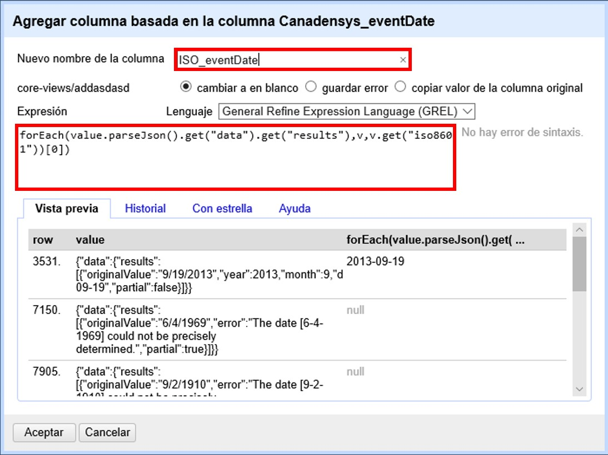
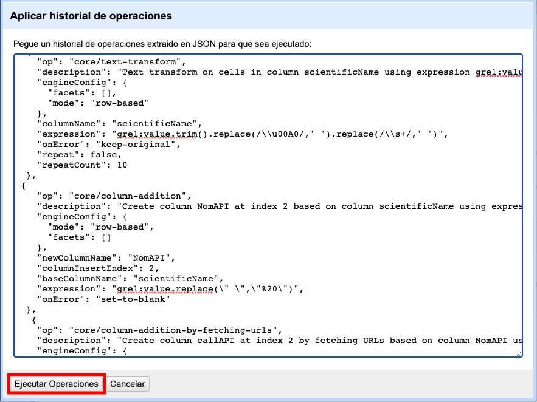

== Rutinas de validación de la calidad de los datos

A partir del uso de <<sect-4,servicios>> o archivos externos, y la posibilidad que ofrece OpenRefine de <<sect-2.5.2. guardar y rehacer pasos>> es posible crear rutinas para ejecutar de manera automática varias acciones de validación de calidad. 

Aprovechando las múltiples herramientas de calidad de datos ya existentes en la red de GBIF es posible abordar de manera semi-automatizada a través de OpenRefine los retos y problemas más comúnes de calidad que se presentan a nivel taxonómico y geográfico en un conjunto de datos. Acá se presentan diferentes rutinas que validan la calidad de los datos contrastando un conjunto de datos contra dichos servicios externos y agilizan la obtención de resultados a la vez que facilita una metodología de validación replicable.

=== ¿Cómo funcionan las rutinas?

Las rutinas comparan la información documentada en el conjunto de datos contra diferentes fuentes de referencia, y a partir de dicha comparación crean columnas de validación donde se puede identificar la correspondencia entre el archivo original y la fuente de referencia a través de operadores lógicos que generan unos (1) y ceros (0) como indicadores de validación.

Los *indicadores de validación* se interpretan así:

* 0: El valor documentado en el conjunto de datos NO coincide con la fuente de referencia, el valor debe ser revisado y ajustado en caso de ser necesario.
* 1: El valor documentado en el conjunto de datos coincide con la fuente de referencia, no es necesario tomar acciones adicionales.

Observe el ejemplo de la (<>), en la primera fila el valor original de la columna [source]`"family"` no coincide con la columna [source]`"familySuggested"` ya que tiene un error de tipeo, por lo tanto el indicador de validación (columna [source]`"familyValidation"`) es cero (0). Note que en las filas donde si hay coincidencia el indicador de validación ([source]`"familyValidation"`) es uno (1).

[#img-fig-53]
.Figura 53. Ejemplo de los indicadores de validación
image::img/es.figure-53.jpg[Figura 53,align=center]

Las rutinas utilizan como fuentes de validación API’s (Interfaces de Programación de Aplicaciones) de repositorios globales taxonómicos, geográficos y herramientas de estandarización; o  archivos de texto plano obtenidos como resultado de herramientas de validación externas. 

En la <<#table-scripts>> encontrará cinco (5) rutinas, que cubren diferentes escenarios al momento de realizar la validación, como la caída temporal de servicios web, o requisitos adicionales según la naturaleza de los datos, como por ejemplo el grupo biológico de interés. Se explica a continuación cada fuente:

[#table-scripts]
.Lista de rutinas para la validación de datos primarios sobre biodiversidad
[cols=3*,options="header"]
|===
| Nombre | Uso | Requerimientos 
| link:https://github.com/SIB-Colombia/data-quality-open-refine/blob/master/ValTaxonomicAPIGBIF_ValTaxonomicaAPIGBIF.txt[Validación taxonómica con el API de GBIF]
| Validación taxonómica que usa como referencia el árbol taxonómico de GBIF. Permite validar registros de varios grupos biológicos a la vez, así como obtener la taxonomía superior de cada taxa.
| Requiere como mínimo los elementos [source]`"scientificName"` y [source]`"kingdon"` documentados y acceso a internet para hacer la petición al API de GBIF.

| link:https://github.com/SIB-Colombia/data-quality-open-refine/blob/master/ValTaxonomicSpeciesMatchGBIF_ValTaxonomicaSpeciesMatchGBIF.txt[Validación taxonómica con Species Match de GBIF] 
| Validación taxonómica que usa como referencia el árbol taxonómico de GBIF, a diferencia de la rutina anterior realiza la validación contra el archivo de resultados _normalized_ obtenido de link:https://www.gbif.org/es/tools/species-lookup[_Species Matching_] permitiendo así aprovechar las funcionalidades de validación y limpieza de esta herramienta. La rutina facilita el cruce de los resultados obtenidos con link:https://www.gbif.org/es/tools/species-lookup[_Species Matching_] con el conjunto de datos original. 
| Requiere como mínimo el elemento [source]`"scientificName"` documentado y que el archivo _normalized_ sea previamente cargado en OpenRefine para la ejecución de la rutina.

| link:https://github.com/SIB-Colombia/data-quality-open-refine/blob/master/ValTaxonomicAPIWoRMS_ValTaxonomicaAPIWoRMS.txt[Validación taxonómica con el API de WoRMS (World Register of Marine Species)]
| Validación taxonómica específica para organismos marinos, que usa como referencia el link:https://www.lifewatch.be/en/lifewatch-species-information-backbone[árbol taxonómico de LifeWatch (LW-SIBb)] por medio de la API de link:http://www.marinespecies.org/aphia.php?p=webservice[WoRMS (_World Register of Marine Species_)]. Permite obtener la taxonomía superior de cada taxa, así como elementos taxonómicos obligatorios para la publicación de datos a través de link:https://obis.org/[OBIS].
| Requiere como mínimo el elemento [source]`"scientificName"` documentado y acceso a internet para hacer la petición al API de WORMS.

| link:https://github.com/SIB-Colombia/data-quality-open-refine/blob/master/ValElevationAPIGeoNames_ValElevacionAPIGeoNames.txt[Validación de elevaciones con GeoNames] | Validación y/o obtención de la elevación a partir de las coordenadas usando el servicio geográfico de GeoNames. 
| Requiere los elemento DwC [source]`"decimalLatitude"` y [source]`"decimalLongitude"` documentados adecuadamente y acceso a internet para hacer la petición al API de  GeoNames.

| link:https://github.com/SIB-Colombia/data-quality-open-refine/blob/master/DateTransform_TransformFechas.txt[Transformación de fechas con Canadensys _Date Parsing_] | Transformación de fechas en múltiples formatos al estándar ISO 8601.
| Requiere los elemento DwC [source]`"eventDate"`  documentado y acceso a internet para hacer la petición al API de  Canadensys.
|===

Las rutinas cuya fuente de referencia es un API, hacen una consulta  a un <<sect-4,servicio externo>> y extraen la información necesaria para hacer la validación en formato JSON, que luego es interpretada por la rutina haciendo la información legible en forma de columnas dentro del conjunto de datos. Posteriormente el resultado de la consulta al API es comparado con el valor documentado en el conjunto de datos y se generan nuevas columnas con los indicadores de la validación (unos y ceros).
Las rutinas que usan como fuente archivos de texto plano, hacen una consulta sobre un archivo cargado previamente en OpenRefine, que posteriormente es comparado con el valor documentado en el conjunto de datos, como resultado de la comparación se generan nuevas columnas con los indicadores de la validación.

Las rutinas se ejecutan de manera similar, los requerimientos específicos para cada una se detallan más adelante. En esta sección se presentan instrucciones generales para su ejecución en OpenRefine:
 
****
[discrete]
=== Paso 1

*Carga de los archivos a OpenRefine*

Cree un proyecto en OpenRefine con el conjunto de datos que desea validar, si tiene dudas sobre cómo hacerlo revise la <<sect-1, sección 1>>. Asegúrese que el conjunto de datos o los elementos que desea validar estén estructurados en el estándar Darwin Core, si no lo están ajuste el nombre de cada columna según el estándar siguiendo las instrucciones de la <<sect-2.1.1, sección 2.1.1>>.

Según la validación que desee realizar asegurese de cumplir los requerimientos de la rutina. Si la rutina lo requiere cargue también en OpenRefine los archivos adicionales de validación (ver <<table-scripts,Tabla 2.>>), de lo contrario vaya directamente al paso 2.
****

****
[discrete]
=== Paso 2

*Ejecutar la rutina*

Ubiqué la rutina de interés según la validación que desee realizar, en el repositorio en GitHub al que lo dirige el enlace de la Tabla 2 (ver <<table-scripts,Tabla 2.>>), copie el texto de la rutina de validación. Asegúrese de seleccionar solo la rutina -sin las intrucciones- y copiar todos  los corchetes iniciales ({) y finales (}).

Ubíquese en el conjunto de datos a validar en OpenRefine, diríjase al menú arriba a la izquierda, seleccione la pestaña “Deshacer/Rehacer” y haga clic en el botón “Aplicar...”. A continuación se abrirá una ventana de texto vacía, pegue en el cuadro de texto la rutina a ejecutar y haga click en “Ejecutar Operaciones” (<>). Si tiene dudas sobre este proceso revise la <<sect-2.5, sección 2.5>>.

[#img-fig-54]
.Figura 54
image::img/es.figure-54.jpg[Figura 54,align=center]

El avance de la ejecución de la rutina se observa en la parte superior de la pantalla (<>).

[#img-fig-55]
.Figura 55

Espere a que finalice la ejecución de la rutina. Las rutinas que requieren hacer llamados a servicios externos, dependen de la conexión a internet, estas consultas toman un tiempo en correr que varía según el número de filas del conjunto de datos, de la velocidad de la conexión y de la memoria RAM del equipo. 

****

****
[discrete]
=== Paso 3

**Resultados de la validación**

Al terminar la ejecución de la rutina, obtendrá nuevas columnas en el conjunto de datos, puede identificarlas por su terminación:

* _Suggested_: valores sugeridos resultantes de la validación con las fuentes de referencia, dependiendo de la rutina seleccionada pueden ser sugerencias taxonómicas o geográficas.

* _Validation_: corresponden a los indicadores de validación (unos y ceros) que permiten rastrear diferencias entre el valor original y el valor sugerido, y realizar posteriormente una limpieza de los datos. 

En la (<>) se muestra un ejemplo de como se ven los identificadores de la validación y las nuevas columnas con las sugerencias después de correr la rutina; en el ejemplo se observa una validación taxonómica, las columnas de resultado varían según el objetivo de cada rutina.
[#img-fig-56]
.Figura 56
image::img/es.figure-56.jpg[Figura 56,align=center]

****

****
[discrete]
=== Paso 4

**Limpieza de los datos**

A partir de las nuevas columnas de validación (finalizan en las palabra _Suggested_) seleccione los registros donde el valor original y el valor sugerido son diferentes (identificador de validación = 0) y realice los ajustes que considere necesarios sobre los elementos del estándar Darwin Core. Se recomienda realizar este proceso de limpieza utilizando las funcionalidades de OpenRefine descritas en la sección << sect-2, de limpieza de datos>>. El proceso de validación busca facilitar la identificación de filas y elementos que necesitan ser revisados, un identificador de validación con valor cero (0) no necesariamente implica que haya un error en los datos, pero si que debe ser revisado y según el criterio de cada publicador ajustado o no.

Por ejemplo de la (<>) se muestra una << sect-2.2.1, Faceta de texto>> que filtra las filas cuyo indicador de validación es cero (0) para el elemento de familia y por lo tanto necesita ser verificado. En la primera fila se muestra una inconsistencia entre la familia documentada en el conjunto de datos original y la sugerida por la rutina, mientras en la segunda fila se evidencia un problema de tipeo. **En cada caso de deber revisar de manera integral cada fila y decidir que ajuste se debe o no realizar**.

[#img-fig-57]
.Figura 57

Una vez terminada la validación y limpieza de sus datos, puede eliminar las columnas resultantes de la validación (finalizan en las palabras _Validation_ y _Suggested_) y dejar solo las columnas corregidas de su archivo original.

****

=== Validación taxonómica con el API de GBIF

*Enlace a la rutina:* https://github.com/SIB-Colombia/data-quality-open-refine/blob/master/ValTaxonomicAPIGBIF_ValTaxonomicaAPIGBIF.txt

*Requerimientos:*

* El conjunto de datos a validar debe tener como mínimo los elementos DwC [source]`"scientificName"` y [source]`"kingdon'"` documentados.

* Si también desea validar la taxonomía superior de su conjunto de datos se requieren los elementos DwC: [source]`"scientificName"`, [source]`"kingdon"`,[source]`"phylum"`,[source]`"class"`,[source]`"order"`,[source]`"family"`,[source]`"genus"`.

*Funcionamiento:*

Esta rutina obtiene y valida la información taxonómica de un conjunto de datos usando como referencia el árbol taxonómico de GBIF, esto se hace a través de un llamado al API de GBIF basado en los elementos del estándar Darwin Core [source]`"scientificName"` y [source]`"kingdom"` documentados en el conjunto de datos. Como resultado, el llamado retorna la taxonomía superior, nombres aceptados, estatus taxonómico y autoría del nombre científico de acuerdo al árbol taxonómico de GBIF. La rutina toma los valores obtenidos del árbol taxonómico de GBIF y los compara con los elementos documentados en el archivo base, generando los indicadores de validación.

*Resultados:*

En las primeras columnas del proyecto encontrará las columnas con los datos taxonómicos reorganizadas junto con nuevas columnas resultantes de la rutina. Primero encontrará las columnas asociadas al cruce con el árbol taxonómico y luego de manera intercalada columnas con el valor taxonómico original, un valor sugerido de acuerdo al árbol taxonómico de GBIF y el indicador de validación indicando si los valores son iguales (1) o difieren (0) como se muestra en la (<>).

[#img-fig-58]
.Figura 58
image::img/es.figure-58.jpg[Figura 58,align=center]

A continuación se listan las columnas que encontrará después de correr la rutina:

* `taxonMatchType`: Indica el resultado del cruce de los datos originales con el árbol taxonómico de GBIF a partir de los elementos [source]`"scientificName"` y [source]`"scientificName"`. Los valores posibles son:
** EXACT: La correspondencia entre el [source]`"scientificName"` del conjunto de datos y el árbol taxonómico es completa.
** FUZZY: La correspondencia entre el [source]`"scientificName"` del conjunto de datos y el árbol taxonómico es parcial, el nombre difiere en su escritura, comunmente indica errores de tipeo o diferencias por correcciones nomenclaturales (ejem: la terminación `i` vs. `ii` cuando la especie se dedica a una persona). 
** HIGHERRANK: La correspondencia entre el [source]`"scientificName"` del conjunto de datos y el árbol taxonómico fue parcial, no se identificó el taxon al nivel taxonomico del [source]`"scientificName"` si no a un nivel superior. Por ejemplo si el [source]`"scientificName"` corresponde a una especie, la correspondencia con el árbol taxonómico de GBIF fue a nivel de género. Esto sucede porque el taxon aún no está en el árbol taxonómico de GBIF, o por errores de tipeo mayores.
** NONE y BLANK: La correspondencia entre el [source]`"scientificName"` del conjunto de datos y el árbol taxonómico fue *nula* o *hubo varias coincidencias* con muy poca información para determinar un resultado, esto sucede comunmente cuando hay homónimos o si el taxon aún no se encuentra en el árbol taxonómico de GBIF como es el caso de especies descritas recientemente o endémicas para las cuales se posee muy poca información.

* `scientificName`: Columna original del conjunto de datos.
* `acceptedScientificName`: Nombre científico aceptado según el árbol taxonómico de GBIF.
* `canonicalNameSuggested`: Nombre canónico sugerido según el árbol taxonómico de GBIF.
*  `taxonRankSuggested`: Categoría del taxon sugerido según el árbol taxonómico de GBIF (ejem:SPECIES, GENUS, FAMILY).
*  `taxonomicStatusSuggested`: Estado del taxón sugerido según el árbol taxonómico de GBIF (ejem:ACCEPTED, SYNONYM).
*  Tripleta de elementos validados donde se encuentra la columna original del conjunto de datos, la columna de validación y la columna con la sugerencia según el árbol taxonómico, por ejemplo: [source]`"class"`,[source]`"classValidation"`,[source]`"classSuggested"`. Los siguientes elementos de estar documentados en el conjunto de datos original tendrán dicha tripleta: [source]`"scientificNameAuthorship"`, [source]`"kingdom"`, [source]`"phylum"`, [source]`"class"`, [source]`"order"`, [source]`"family"`, [source]`"genus"`, [source]`"specificEpithet"`
*  `callAPI`: Respuesta del API a la rutina, contiene todos los resultados en formato JSON.

IMPORTANT: El llamado al API permite hacer una consulta sobre un número ilimitado de registros, sin embargo si su conjunto de datos tiene muchas filas se recomienda ejecutar la rutina sobre nombres científicos únicos, lo cual disminuirá  el tiempo de respuesta y agilizará la ejecución de la rutina.

=== Validación taxonómica con link:https://www.gbif.org/es/tools/species-lookup[_Species Matching_] de GBIF

*Enlace a la rutina:*
https://github.com/SIB-Colombia/data-quality-open-refine/blob/master/ValTaxonomicSpeciesMatchGBIF_ValTaxonomicaSpeciesMatchGBIF.txt

*Requerimientos:*

* El conjunto de datos a validar debe tener como mínimo el elemento DwC [source]`"scientificName"` documentado.

* Si también desea validar la taxonomía superior de su conjunto de datos se requieren los elementos DwC: [source]`"scientificName"`, [source]`"kingdon"`,[source]`"phylum"`,[source]`"class"`,[source]`"order"`,[source]`"family"`,[source]`"genus"`.

* Archivo titulado _normalized_ obtenido de la herramienta link:https://www.gbif.org/es/tools/species-lookup[_Species Matching_] y cargado en OpenRefine, el nombre del proyecto debe ser exactamente _normalized_.

WARNING: El archivo _normalized' debe ser el único proyecto en OpenRefine titulado de esta manera. Cambie el nombre de cualquier otro archivo _normalized_ cargado previamente, de lo contrario la rutina no podrá identificar adecuadamente el archivo de referencia.

*Funcionamiento:*

La rutina obtiene y valida la información taxonómica de un conjunto de datos con el árbol taxonómico de GBIF a partir de el archivo de texto plano _normalized_ obtenido de la herramienta en línea link:https://www.gbif.org/es/tools/species-lookup[_Species Matching_] y cargado en OpenRefine. La rutina retorna la taxonomía superior, nombres aceptados, estatus taxonómico y autoría del nombre científico de acuerdo al árbol taxonómico de GBIF y los compara con los elementos documentados en el archivo base, generando los indicadores de validación.

Al usar _Species matching_ como fuente de referencia, el usuario puede realizar una validación y limpieza previa a OpenRefine directamente en _Species matching_, la cual es especialmente útil para verificar y resolver sinonimias complejas, como es el caso de los homónimos. 

IMPORTANT: A diferencia del API de GBIF, _Species matching_ tiene un límite de consulta de 6.000 registros o nombres científicos. Para evitar exceder el límite de consulta, se recomienda hacer la consulta en _Species matching_  por nombres científicos únicos.

*Resultados:*

Como en la rutina anterior, en las primeras columnas del proyecto encontrará de manera intercalada una columna con el valor taxonómico original, un valor sugerido de acuerdo al árbol taxonómico de GBIF y el indicador de validación indicando si los valores son iguales (1) o difieren (0) como se muestra en la (<>). Obtendrá las mismas  columnas que en la rutina anterior menos `callAPI`.

=== Validación taxonómica con el API de WoRMS (_World Register of Marine Species_)

*Enlace a la rutina:*
https://github.com/SIB-Colombia/data-quality-open-refine/blob/master/ValTaxonomicAPIWoRMS_ValTaxonomicaAPIWoRMS.txt

*Requerimientos:*
* El conjunto de datos a validar debe tener como mínimo el elemento DwC [source]`"scientificName"` documentado.

* Si también desea validar la taxonomía superior de su conjunto de datos se requieren los elementos DwC: [source]`"scientificName"`, [source]`"kingdon"`,[source]`"phylum"`,[source]`"class"`,[source]`"order"`,[source]`"family"`,[source]`"genus"`.

*Funcionamiento:*
Esta rutina está diseñada para ser implementada en conjuntos de datos de grupos biológicos marinos, emplea como fuente de referencia los taxones marinos del link:https://www.lifewatch.be/en/lifewatch-species-information-backbone[árbol taxonómico de LifeWatch (LW-SIBb)] a través de un llamado al API de link:http://www.marinespecies.org/aphia.php?p=webservice[WoRMS (_World Register of Marine Species_)]. La rutina retorna la taxonomía superior, nombres aceptados, estatus taxonómico y autoría del nombre científico de acuerdo al árbol taxonómico de LifeWatch y los compara con los elementos documentados en el archivo base, generando los indicadores de validación. 

Adicionalmente a los elementos taxonómicos, esta rutina retorna otros elementos útiles como el LSID de WORMS o AphiaID, elemento requerido para la publicación de datos a través de link:https://obis.org/[OBIS (Ocean Biogeographic Information System)] y elementos que dan información sobre el tipo de hábitat del taxón.

*Resultados:*
En las primeras columnas del proyecto encontrará de manera intercalada una columna con el valor taxonómico original, un valor sugerido de acuerdo al árbol taxonómico de LifeWatch y el indicador de validación indicando si los valores son iguales (1) o difieren como se muestra en la (<>).

[#img-fig-59]
.Figura 59

A continuación se listan las columnas que encontrará despues de correr la rutina, adicionales a las ya mencionadas en la rutina Validación taxonómica con el API de GBIF:

* [source]`"matchType"`:
** `exact`:
** `phonetic`:
** `near_1`:
** `near_2`:
** `near_3`:
** [source]`"match_quarantine"`:
** [source]`"match_deleted"`:
* [source]`"scientificNameID"`: Identificador del taxón contruido a partir del AphiaID en el árbol  taxonómico de WoRMS. 
nameAccordingTo
nameAccordingToID
*  [source]`"isMarine"`: Valor booleano (TRUE o FALSE) que indica si el registro corresponde a un taxon marino.
* [source]`"isBrackish"`: Valor booleano (TRUE o FALSE) que indica si el registro corresponde a un taxon de aguas salobres. 
* [source]`"isFreshwater"`: Valor booleano (TRUE o FALSE) que indica si el registro corresponde a un taxon de aguas continentales. i.e. taxones asociados a ríos o lagos.
* [source]`"isTerrestial"`: Valor booleano (TRUE o FALSE) que indica si el registro corresponde a un taxon terrestre.
Examples: false
*/boorar NomAPIw
* [source]`"callAPIworms"`: Respuesta del API a la rutina, contiene todos los resultados en formato JSON.

=== Validación de elevaciones con GeoNames. 

*Enlace a la rutina:*
https://github.com/SIB-Colombia/data-quality-open-refine/blob/master/ValElevationAPIGeoNames_ValElevacionAPIGeoNames.txt

*Requerimientos:*

* El conjunto de datos a validar debe tener como mínimo los elemento DwC [source]`"decimalLatitude"` y [source]`"decimalLongitude"` documentados adecuadamente.

* Tener una cuenta activa en GeoNames, si no tiene una link:http://www.geonames.org/login[creela] antes de correr la rutina.

*Funcionamiento:*

WARNING: Antes de ejecutar la rutina remplace la palabra _demo_  en la expresión `_username=demo_` por el nombre de usuario de su cuenta de GeoNames, por ejemplo `_username=rartizgt_`. Si ejecuta la rutina sin hacer este cambio utilizará la opción de prueba (`demo`) incorporada por defecto en la rutina, la cual tiene un límite de 20.000 consultas *diarias mundiales*, por lo que puede que el servicio esté agotado y no obtenga resultados.

La rutina captura la elevación a partir de las coordenadas decimales documentadas en los elementos [source]`"decimalLatitude"` y [source]`"decimalLongitude"` del archivo base, a través de una consulta a los Servicios Web de link:http://www.geonames.org/export/web-services.html[GeoNames]. Esta rutina utiliza el modelo de elevación SRTM-1 (`"srtm1"`), que cuenta con una resolución aproximada de 30 metros. Sin embargo, el usuario puede usar otro de los modelos de elevación disponibles:

Modelos de elevación disponibles en link:http://www.geonames.org/export/web-services.html[GeoNames]:

* SRTM3 (`"srtm3"`): Datos de elevación de la _Shuttle Radar Topography Mission (SRTM)_, con resolución aproximada de 90 x 90 metros.

* Astergdemv2 (`"astergdem"`): Datos de elevación del _Aster Global Digital Elevation Model V2_ (2011) con resolución aproximada de 30 x 30 metros.

* GTOPO30 (`"gtopo30"`): Modelo de elevación global con resolución aproximada de 30 arcos por segundo, equivalente a una grilla de 1 km x 1 km.

Para cambiar la fuente del modelo de elevación remplace en la rutina el valor `srtm1`  en la expresión `http://api.geonames.org/srtm1'` por el valor que corresponda al servicio que desea utilizar `srtm3`, `astergdem` o `gtopo30`.

*Resultados:*

En las primeras columnas del proyecto encontrará las columnas con los datos de elevación reorganizadas junto con nuevas columnas resultantes de la rutina. Encontrará las cde manera intercalada las columnas originales, un valor sugerido de acuerdo al servicio de elevación y dos indicadores de validación (<>). El primer indicador contrasta la elevación obtenida con el servicio y el elemento [source]`"minimumElevationInMeters"` y debe ser interpretado así: 

* 1: La diferencia entre la elevación en [source]`"minimumElevationInMeters"` y [source]`"elevationSuggested"` es menor a 100 msnm
* 0: La diferencia entre la elevación en [source]`"minimumElevationInMeters"` y [source]`"elevationSuggested"` es mayor a 100 msnm
* blank: No hay elevación mínima documentada.

El segundo indicador contrasta la elevación obtenida con el servicio contra el rango de elevación indicado por los elementos [source]`"minimumElevationInMeters"` y [source]`"maximumElevationInMeters"` y debe ser interpretado así: 

* 1: El rango de elevaciones contiene la elevación sugerida
* 0: El rango de elevaciones NO contiene la elevación sugerida

[#img-fig-60]
.Figura 60

WARNING: La rutina se ejecuta sobre valores únicos de pares de coordenadas y se completa para los registros con la misma ubicación, no se realiza la consulta sobre el total de los registros ya que puede superar el límite de consultas por usuario al día.

IMPORTANT: Si las coordenas se encuentran sobre plataforma marina, puede que reciba como resultado valores negativos (ej. -1, -3), o valores como: "/home/data/srtm1/N02/N02W080.zip" o "No data".

=== Transformación de fechas con Canadensys _Date Parsing_

Esta rutina recopila los pasos de la sección <<sect-4.1.3>> y automatiza su ejecución para el mismo procedimiento.

*Enlace a la rutina:*

https://github.com/SIB-Colombia/data-quality-open-refine/blob/master/DateTransform_TransformFechas.txt

*Requerimientos:*

* El conjunto de datos a validar debe tener como mínimo el elementos DwC `"eventDate"` documentado.

*Funcionamiento:*

A partir de la fecha documentada en el archivo base en el elemento [source]`"eventDate"` se realiza una consulta al API de Canandensys que retorna las fechas transformadas al estándar ISO 8601. A diferencia de las rutinas anteriores el objetivo de esta rutina es transformar las fechas, no validarlas, por ello no genera los identificadores de validación como en las demás rutinas.

*Resultados*

En las primeras columnas del proyecto encontrará las columnas con los datos temporales reorganizadas junto con nuevas columnas resultantes de la rutina. 

Los elementos resultantes de la ejecución de la rutina, serán agregados al inicio del conjunto de datos con los nombres:

* [source]`"eventDateSuggested"`: Fecha transformada al estander ISO 8601.
* [source]`"yearSuggested"`: Año extraído a partir de la transformación de la fecha.
* [source]`"monthSuggested"`: Mes extraído a partir de la transformación de la fecha.
* [source]`"daySuggested"`: Día extraído a partir de la transformación de la fecha.
* [source]`"verbatimEventDateSuggested"`: Fecha en el formato original, no se asigna directamente al elemento DwC [source]`"verbatimEventDate"` para evitar conflictos.

Para no generar conflicto con elementos ya existentes en el conjunto de datos todas las columnas generadas por la rutina se marcan como sugeridas o _Suggested_ (<>). Si algún registro no tiene datos de fecha, los elementos resultantes apareceran vacios.

[#img-fig-61]
.Figura 61

IMPORTANT: Los formatos de fechas que son ambiguos, es decir donde no se diferencia con claridad el mes, el día o el año, no son transformados. Revise las celdas donde el resultado haya sido nulo o vacío y realice los ajustes necesarios de forma manual.
