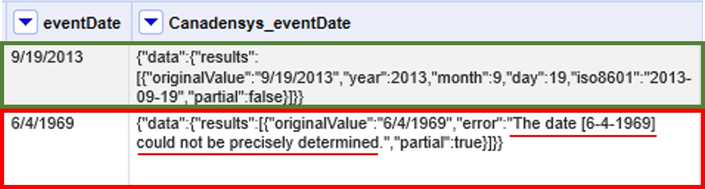
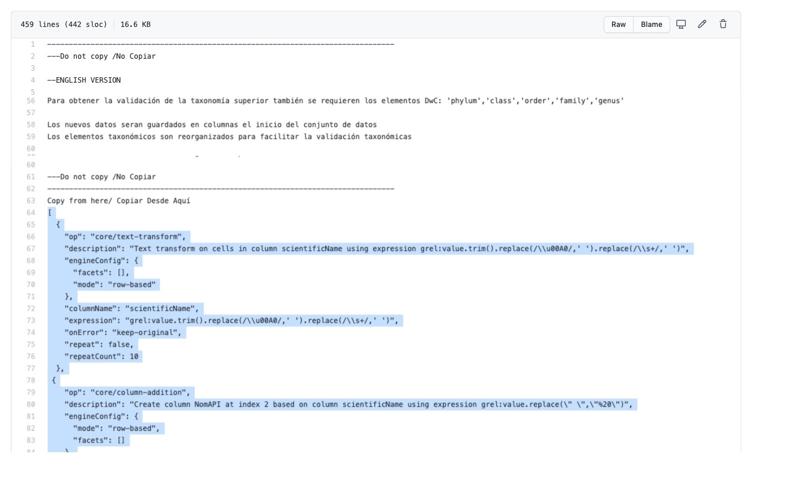

== Rutinas de validación de la calidad de los datos

A partir del uso de <<sect-4,servicios>> o archivos externos, y la posibilidad que ofrece OpenRefine de <<sect-2.5.2. guardar y rehacer pasos>> es posible crear rutinas para ejecutar de manera automática varias acciones de validación de calidad. 

Aprovechando las múltiples herramientas de calidad de datos ya existentes en la red de GBIF es posible abordar de manera semi-automatizada a través de OpenRefine los retos y problemas más comúnes de calidad que se presentan a nivel taxonómico y geográfico en un conjunto de datos. Acá se presentan diferentes rutinas que validan la calidad de los datos contrastando un conjunto de datos contra dichos servicios externos y agilizan la obtención de resultados a la vez que facilita una metodología de validación replicable.

=== ¿Cómo funcionan las rutinas?

Las rutinas comparan la información documentada en el conjunto de datos contra diferentes fuentes de referencia, y a partir de dicha comparación crean columnas de validación donde se puede identificar la correspondencia entre el archivo original y la fuente de referencia a través de operadores lógicos que generan unos (1) y ceros (0) como indicadores de validación (<>).

Los *indicadores de validación* se interpretan así:

* 0: El valor documentado en el conjunto de datos NO coincide con la fuente de referencia, el valor debe ser revisado y ajustado en caso de ser necesario.
* 1: El valor documentado en el conjunto de datos coincide con la fuente de referencia, no es necesario tomar acciones adicionales.

[#img-fig-53]
.Figura 53. Ejemplo de los indicadores de validación
image::img/es.figure-53.jpg[Figura 53,align=center]

Las rutinas utilizan como fuentes de validaciónAPI’s (Interfaces de Programación de Aplicaciones) de repositorios globales taxonómicos y geográficos; o  archivos de texto plano obtenidos como resultado de herramientas de validación externas y  fuentes nacionales oficiales. Se explica a continuación cada fuente:

Las rutinas cuya fuente de referencia es un API, hacen una consulta  a un <<sect-4,servicio externo>> y extraen la información necesaria para hacer la validación, esta se obtiene en formato JSON y es interpretada por la rutina para hacer la información legible dentro del conjunto de datos en forma de columnas. Posteriormente el resultado de la consulta al API es comparado con el valor documentado en el conjunto de datos y se generan nuevas columnas con los indicadores de la validación(unos y ceros).
Las rutinas que usan como fuente archivos de texto plano, hacen una consulta sobre un archivo cargado previamente en OpenRefine, que posteriormente es comparado con el valor documentado en el conjunto de datos, como resultado de la comparación se generan nuevas columnas con los indicadores de la validación.

Acá encontrará  X rutinas de limpieza <<#table-scripts>>, teniendo en cuenta diferentes escenarios al momento de realizar la validación, como la caída temporal de servicios web, o requisitos adicionales según la naturaleza de los datos, como por ejemplo el grupo biológico de interés. 

[#table-scripts]
.Lista de rutinas para la validación de datos primarios sobre biodiversidad
[cols=3*,options="header"]
|===
| Nombre | Uso | Requerimientos 
| link:https://github.com/SIB-Colombia/data-quality-open-refine/blob/master/ValTaxonomicAPIGBIF_ValTaxonomicaAPIGBIF.txt[Validación taxonómica con el API de GBIF.]
| Validación taxonómica contra el árbol taxonómico de GBIF, permité validar registros de varios grupos biológicos a la vez, así como obtener la taxonomía superior de cada taxa.  | Require como mínimo los elementos [source]`"scientificName"` y [source]`"kingdon"` documentados y acceso a internet para hacer la petición al API de GBIF.

| link:https://github.com/SIB-Colombia/data-quality-open-refine/blob/master/ValTaxonomicSpeciesMatchGBIF_ValTaxonomicaSpeciesMatchGBIF.txt[Validación taxonómica con Species Match de GBIF.] 
| Validación taxonómica contra el árbol taxonómico de GBIF, a diferencia de la rutina anterior realiza la validación contra el archivo de resultados _normalized_ obtenido de link:https://www.gbif.org/es/tools/species-lookup[_Species Matching_] permitiendo así aprovechar las funcionalidades de validación y limpieza de esta herramienta. La rutina facilita el cruce de los resultados obtenidos con link:https://www.gbif.org/es/tools/species-lookup[_Species Matching_] con el conjunto de datos original. | Require como mínimo el elemento [source]`"scientificName"` documentado y que el archivo _normalized_ sea previamente cargado en OpenRefine para la ejecución de la rutina.

| link:https://github.com/SIB-Colombia/data-quality-open-refine/blob/master/ValTaxonomicAPIWoRMS_ValTaxonomicaAPIWoRMS.txt[Validación taxonómica con el API de WoRMS (World Register of Marine Species]) 
| Validación taxonómica específica para organismos marinos, valida los datos contra el link:https://www.lifewatch.be/en/lifewatch-species-information-backbone[árbol taxonómico de LifeWatch (LW-SIBb)]. Permité obtener la taxonomía superior de cada taxa, así como elementos taxonómicos obligatorios para la publicación de datos a través de link:https://obis.org/[OBIS]
| Require como mínimo el elemento [source]`"scientificName"` documentado y acceso a internet para hacer la petición a  la API de WORMS.

| link:https://github.com/SIB-Colombia/data-quality-open-refine/blob/master/ValElevationAPIGeoNames_ValElevacionAPIGeoNames.txt[Validación de elevaciones con GeoNames] | Validación y/o obtención de la elevación a partir de las coordenadas usando el servicio geográfico de GeoNames | Requiere acceso a internet para hacer la petición al API de  Geonames.
|===

Las rutinas se ejecutan de manera similar, los requerimientos específicos para cada una se detallan más adelante. En esta sección se presentan instrucciones generales para su ejecución en OpenRefine:
 
****
[discrete]
=== Paso 1

*Carga de los archivos a OpenRefine*

Cree un proyecto en OpenRefine con el conjunto de datos que desea validar, si tiene dudas sobre cómo hacerlo revise la <<sect-1, sección 1>>. Asegúrese que el conjunto de datos o los elementos que desea validar estén estructurados en el estándar Darwin Core, si no lo están ajuste el nombre de cada columna según el estándar siguiendo las instrucciones de la <<sect-2.1.1, sección 2.1.1>>.

Según la validación que desee realizar asegurese de cumplir los requerimientos de la rutina. Si la rutina lo requiere cargue también en OpenRefine los archivos adicionales de validación (ver <<table-scripts,Tabla 1.>>), de lo contrario vaya directamente al paso 2.
****

****
[discrete]
=== Paso 2

*Ejecutar la rutina*

Ubiqué la rutina de interés según la validación que desee realizar (ver <<table-scripts,Tabla 2.>>), copie el texto de la rutina de validación. Asegúrese de seleccionar solo la rutina -sin las intrucciones- y copiar todos  los corchetes iniciales ({) y finales (}) (<>).

[#img-fig-54]
.Figura 54

Ubíquese en el conjunto de datos a validar en OpenRefine, diríjase al menú de arriba a la izquierda, seleccione la pestaña “Deshacer/Rehacer” y haga clic en el botón “Aplicar...”. A continuación se abrirá una ventana de texto vacía, pegue en el cuadro de texto la rutina a ejecutar y haga click en “Ejecutar Operaciones”. Si tiene dudas sobre este proceso revise la <<sect-2.5, sección 2.5>>.

El avance de la ejecución de la rutina se observa en la parte superior de la pantalla (<>).

[#img-fig-55]
.Figura 55
image::img/es.figure-55.jpg[Figura 55,align=center]

Espere a que finalice la ejecución de la rutina. Las rutinas que requieren hacer llamados a servicios externos, dependen de la conexión a internet, estas consultas toman un tiempo en correr que varía según el número de filas del conjunto de datos, de la velocidad de la conexión y de la memoria RAM del equipo. 

****

****
[discrete]
=== Paso 3

**Resultados de la validación**

Al terminar la ejecución de la rutina, obtendrá nuevas  en el conjunto de datos, puede identificarlas por su terminación:

* _Suggested_: valores sugeridos resultantes de la validación con las fuentes de referencia, dependiendo de la rutina seleccionada pueden ser sugerencias taxonómicas o geográficas.

* _Validation_: corresponden a los indicadores de validación (unos y ceros) que permiten rastrear diferencias entre el valor original y el valor sugerido, y realizar posteriormente una limpieza de los datos. 

[#img-fig-56]
.Figura 56
image::img/es.figure-56.jpg[Figura 56,align=center]

****

****
[discrete]
=== Paso 4

**Limpieza de los datos**

A partir de las nuevas columnas de validación seleccione los registros donde el valor original y el valor sugerido son diferentes (Identificador de validación = 0) y realice los ajustes que considere necesarios sobre los elementos del estándar Darwin Core. Se recomienda realizar este proceso de limpieza utilizando las funcionalidades de OpenRefine descritas en la sección << sect-2, de limpieza de datos>> (<>).

[#img-fig-57]
.Figura 57
image::img/es.figure-57.jpg[Figura 57,align=center]

Una vez terminada la validación y limpieza de sus datos, puede eliminar las columnas resultantes de la validación y dejar solo las columnas de interes.

****

=== Validación taxonómica con el API de GBIF

*Enlace a la rutina:* https://github.com/SIB-Colombia/data-quality-open-refine/blob/master/ValTaxonomicAPIGBIF_ValTaxonomicaAPIGBIF.txt

*Requerimientos:*

* El conjunto de datos a validar debe tener como mínimo los elementos DwC [source]`"scientificName"` y [source]`"kingdon'"` documentados.

* Si también desea validar la taxonomía superior de su conjunto de datos se requieren los elementos DwC: [source]`"scientificName"`, [source]`"kingdon"`,[source]`"phylum"`,[source]`"class"`,[source]`"order"`,[source]`"family"`,[source]`"genus"`.

*Funcionamiento:*

Esta rutina obtiene y valida la información taxonómica de un conjunto de datos usando como referencia el árbol taxonómico de GBIF, esto se hace a través de un llamado al API de GBIF basado en los elementos del estándar Darwin Core [source]`"scientificName"` y [source]`"kingdom"` documentados en el conjunto de datos. Como resultado, el llamado retorna la taxonomía superior, nombres aceptados, estatus taxonómico y autoría del nombre científico de acuerdo al árbol taxonómico de GBIF. La rutina toma los valores obtenidos del árbol taxonómico de GBIF y los compara con los elementos documentados en el archivo base, generando los indicadores de validación.

*Resultados:*

En las primeras columnas del proyecto encontrará de manera intercalada una columna con el valor taxonómico original, un valor sugerido de acuerdo al árbol taxonómico de GBIF y el indicador de validación indicando si los valores son iguales (1) o difieren como se muestra en la (<>).

[#img-fig-58]
.Figura 58

IMPORTANT: El llamado al API permite hacer una consulta sobre un número ilimitado de registros, sin embargo si su conjunto de datos tiene muchas filas se recomienda ejecutar la rutina haciendo un filtro por nombres científicos únicos, lo cual disminuirá  el tiempo de respuesta y agilizará la ejecución de la rutina.

=== Validación taxonómica con link:https://www.gbif.org/es/tools/species-lookup[_Species Matching_] de GBIF

*Enlace a la rutina:*
https://github.com/SIB-Colombia/data-quality-open-refine/blob/master/ValTaxonomicSpeciesMatchGBIF_ValTaxonomicaSpeciesMatchGBIF.txt

*Requerimientos:*

* El conjunto de datos a validar debe tener como mínimo los elementos DwC [source]`"scientificName"` y [source]`"kingdon'"` documentados.

* Si también desea validar la taxonomía superior de su conjunto de datos se requieren los elementos DwC: [source]`"scientificName"`, [source]`"kingdon"`,[source]`"phylum"`,[source]`"class"`,[source]`"order"`,[source]`"family"`,[source]`"genus"`.

* Archivo titulado _normalized_ obtenido de la herramienta link:https://www.gbif.org/es/tools/species-lookup[_Species Matching_] y cargado en OpenRefine, el nombre del proyecto debe ser exactamente _normalized_.

WARNING: El archivo _normalized' debe ser el único proyecto en OpenRefine titulado de esta manera. Cambie el nombre de cualquier otro archivo _normalized_ cargado previamente, de lo contrario la rutina no podrá identificar adecuadamente el archivo de referencia.

*Funcionamiento:*

La rutina obtiene y valida la información taxonómica de un conjunto de datos con el árbol taxonómico de GBIF a partir de el archivo de texto plano - normalized_ obtenido de la herramienta en línea link:https://www.gbif.org/es/tools/species-lookup[_Species Matching_] y cargado en OpenRefine. La rutina retorna la taxonomía superior, nombres aceptados, estatus taxonómico y autoría del nombre científico de acuerdo al árbol taxonómico de GBIF y los compara con los elementos documentados en el archivo base, generando los indicadores de validación.

Al usar _Species matching_ como fuente de referencia, el usuario puede realizar una validación y limpieza previa a OpenRefine directamente en _Species matching_, la cual es especialmente útil para verificar y resolver sinonimias complejas, como es el caso de los homónimos. 

IMPORTANT: A diferencia del API de GBIF, _Species matching_ tiene un límite de consulta de 6.000 registros o nombres científicos. Para evitar exceder el límite de consulta, se recomienda hacer la consulta en _Species matching_  por nombres científicos únicos.

*Resultados:*

Como en la rutina anterior, en las primeras columnas del proyecto encontrará de manera intercalada una columna con el valor taxonómico original, un valor sugerido de acuerdo al árbol taxonómico de GBIF y el indicador de validación indicando si los valores son iguales (1) o difieren como se muestra en la (<>).

=== Validación taxonómica con el API de WoRMS (_World Register of Marine Species_)

*Enlace a la rutina:*
https://github.com/SIB-Colombia/data-quality-open-refine/blob/master/ValTaxonomicAPIWoRMS_ValTaxonomicaAPIWoRMS.txt

*Requerimientos:*
* El conjunto de datos a validar debe tener como mínimo el elemento DwC [source]`"scientificName"` documentado.

* Si también desea validar la taxonomía superior de su conjunto de datos se requieren los elementos DwC: [source]`"scientificName"`, [source]`"kingdon"`,[source]`"phylum"`,[source]`"class"`,[source]`"order"`,[source]`"family"`,[source]`"genus"`.

*Funcionamiento:*
Esta rutina está diseñada para ser implementada en conjuntos de datos de grupos biológicos marinos, emplea como fuente de referencia los taxones marinos del link:https://www.lifewatch.be/en/lifewatch-species-information-backbone [árbol taxonómico de LifeWatch (LW-SIBb)]a través de un llamado al API de link:http://www.marinespecies.org/aphia.php?p=webservice[WoRMS (_World Register of Marine Species_)].La rutina retorna la taxonomía superior, nombres aceptados, estatus taxonómico y autoría del nombre científico de acuerdo al árbol taxonómico de LifeWatch y los compara con los elementos documentados en el archivo base, generando los indicadores de validación. 

Adicionalmente a los elementos taxonómicos, esta rutina retorna otros elementos útiles como el [source]`"scientificNameID"` a partir del LSID de WORMS o AphiaID, elemento requerido para la publicación de datos a través de link:https://obis.org/ [OBIS (Ocean Biogeographic Information System)]. La rutina también permite obtener información sobre el tipo de hábitat del taxón (Elementos del estándar Darwin Core: [source]`"isMarine"`, [source]`"isFreshwater"`, [source]`"isBrackish"`, [source]`"isTerrestial"`).

*Resultados:*
En las primeras columnas del proyecto encontrará de manera intercalada una columna con el valor taxonómico original, un valor sugerido de acuerdo al árbol taxonómico de LifeWatch y el indicador de validación indicando si los valores son iguales (1) o difieren como se muestra en la (<>), y los elementos adicionales [source]`"scientificNameID"`,[source]`"isMarine"`, [source]`"isFreshwater"`, [source]`"isBrackish"`, [source]`"isTerrestial"` (<>).
.

[#img-fig-59]
.Figura 59
image::img/es.figure-59.jpg[Figura 59,align=center]
