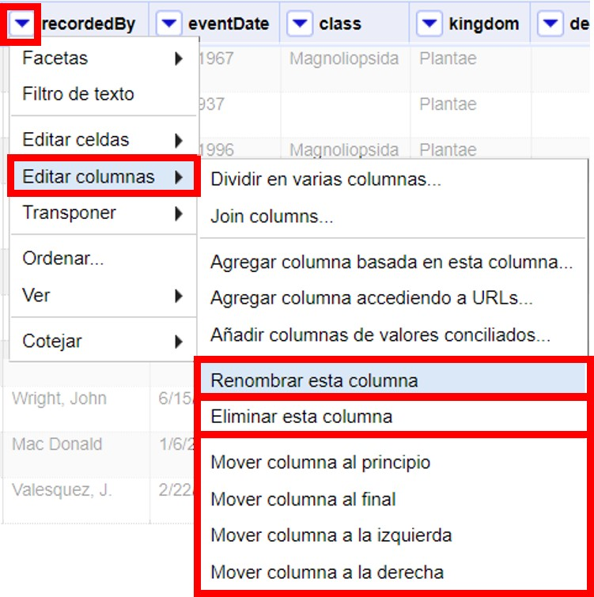
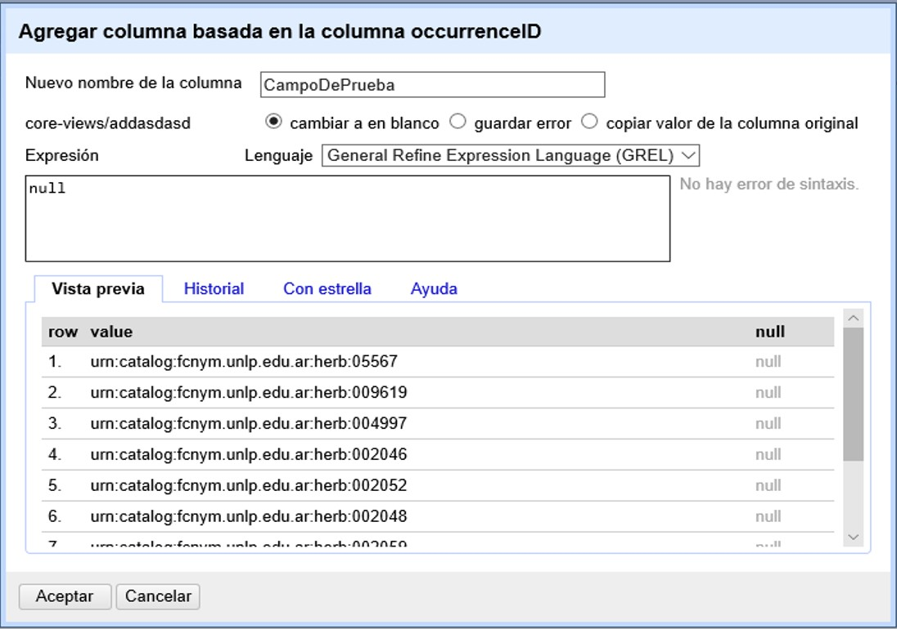

== Limpieza de datos 

=== Manejo básico de columnas

Muchas veces no queremos modificar los datos directamente en los campos (columnas) en que se presentan, dado que queremos mantener los valores originales y/o queremos proveer información adicional basada en ciertos campos. Por ejemplo, podríamos tener como campos individuales el género y el epíteto específico y queremos agregar el campo nombre científico como concatenación de los dos; o viceversa: tenemos un único campo nombre científico y queremos proveer ese campo y otros dos campos para género y epíteto, a partir de la división del anterior pero sin perderlo. 

Para estos casos es útil crear nuevos campos en nuevas columnas.

// Buscar otra denominación para que no sea igual al título de la sección -PZ
==== Manejo básico de columnas

Veamos primero algunas funciones básicas que se pueden aplicar sobre los campos:

1.	*Renombrar un campo.* 
+
Hacer click en la flecha azul del campo -> Editar columnas -> Renombrar esta columna

2.	*Eliminar un campo.*
+
Hacer click en la flecha azul del campo -> Editar columnas -> Eliminar esta columna

3.	*Mover un campo.*
+
Hacer click en la flecha azul del campo 
-> Editar columnas -> Mover columna al principio 
-> -> Mover columna al final
-> -> Mover columna a la izquierda
-> -> Mover columna a la derecha
+
Estas tres opciones pueden verse en la <>.
+
[#img-fig-07]
.Figura 7
image::img/es.figure-07.jpg[Figura 7,align=center]

4.	*Reordenar o eliminar varios campos a la vez.*
+
Hacer click en la flecha azul en el campo “Todo” (<>).
+
-> Editar columnas -> Ordenar / Eliminar columnas…
+
Se abrirá entonces una ventana como la que se muestra en la <>. Allí puede ordenar los campos simplemente arrastrándolos arriba o abajo en la lista, y eliminarlos arrastrándolos hacia la parte derecha de la ventana. Una vez que termine de modificar el orden de los campos, haga click en “Aceptar”.
+
[#img-fig-08]
.Figura 8

En OpenRefine se considera que cualquiera de los cuatro cambios descriptos anteriormente son cambios a los datos, y por ende se registran como tales en el historial de cambios (Ver más abajo sección <<sect-2.5,Deshacer y rehacer cambios>>).

==== Nuevas columnas vacías

Se pueden crear nuevos campos en base a cero, uno o más campos preexistentes.

Para crear un nuevo campo de cero, sobre cualquier columna preexistente siga la ruta: 

 Editar columnas -> Agregar columna basada en esta columna…

Se abrirá una ventana como la que se muestra en la <>.

Arriba de todo, coloque el nombre del nuevo campo.

IMPORTANT: Debe tener extremo cuidado al escoger los nombres que dará a las nuevas columnas. Considere que el nombre sea indicativo de lo que contiene (e.g., no le ponga “Columna 1” o “Transformación 3”). OpenRefine no le dejará utilizar nombres que ya hayan sido utilizados para nombrar otros campos dentro del proyecto. Considere qué otros campos tiene en su base de datos original y no utilice nombres que ya hayan sido utilizados, se evitará así importar datos a columnas equivocadas al volver a su base de datos.

Luego, en el cuadro de texto “Expresión” escriba: “null”. Ello quiere decir que se creará un campo con valores nulos. Luego oprima “Aceptar”. Alternativamente, en vez de “null” puede colocar la expresión: "", y el nuevo campo tendrá valores en blanco.

[#img-fig-09]
.Figura 9

El nuevo campo, con el nombre que le haya dado, aparecerá a la derecha de aquel a partir del cual fue generado.

IMPORTANT: Tenga en cuenta que las columnas nuevas que cree en la aplicación no estarán en su base de datos original. Al importar nuevamente los datos que han sido limpiados a su base de datos, dependiendo de cómo esté estructurada esa base de datos, es posible que estas nuevas columnas no sean importadas o que reciba un mensaje de error de importación porque el número de campos del archivo no coincide con el de la base de datos. En estos casos, debe asegurarse de agregar los nuevos campos en su base de datos si desea importar todos los campos nuevos.

==== Nuevas columnas a partir transformaciones simples de otras columnas

Veamos ahora cómo crear nuevas columnas con datos modificados a partir de columnas preexistentes.

===== Concatenaciones

Si desea crear un campo que sea la concatenación de otros dos campos separados, siga la siguiente ruta:
Utilizaremos como ejemplo la concatenación de los campos [source]`"genus"` y [source]`"specificEpithet"`.

Click en la flecha azul del campo [source]`genus`
 -> Editar columnas 	-> Agregar columna basada en esta columna...

Se abrirá una nueva ventana (<>). Puede llamar al nuevo campo “concat_scientificName”, para indicar que se trata de la concatenación (note que ya hay un campo [source]`"scientificName"` en los datos).

En el cuadro de texto, pegue la siguiente expresión:

Expresión ejemplo:	[source]`cells["genus"].value + " " + cells["specificEpithet"].value` +
Expresión general:	[source]`cells["campo1"].value + " " + cells["campo2"].value`

La expresión ejemplo concatena (`+`) los valores del campo [source]`"genus"` ([source]`cells["genus"].value`) y los del campo [source]`"specificEpithet"` ([source]`cells["specificEpithet"].value`), con un espacio entre los valores ("[source]`` ``").

[#img-fig-10]
.Figura 10

Note que esta expresión funciona cuando ambos campos, [source]`"genus"` y [source]`"specificEpithet"`, tienen valores, es decir no son nulos. Si alguno de los dos campos tiene valores nulos, entonces no se lleva a cabo la concatenación. Por ejemplo, si hay un valor para genus pero specificEpithet está vacío, el campo de concatenación aparecerá vacío. Esto se debe a que no se puede operar sobre valores nulos.

En este caso, puede sortear el problema utilizando en cambio la siguiente expresión:

[source,javascript]
----
if(isBlank(cells["genus"].value), "", cells["genus"].value) + " " + if(isBlank(cells["specificEpithet"].value), "", cells["specificEpithet"].value)
----

Lo que dicha expresión significa es: concatenar ([source]`+`) dos partes, cada una proviene de una sub-expresión [source]`if`, separadas por un espacio ([source]`+ " " +`). Cada una de estas sub-expresiones indica: si ([source]`if`) el valor del campo dado es nulo ([source]`isBlank(cells["genus"].value)`), colocar un blanco  ([source]`""`), si no ([source]`,`), colocar el valor del campo ([source]`cells["genus"].value`). La otra sub-expresión es lo mismo pero para epíteto específico.

Los resultados esperados utilizando cada una de las dos fórmulas se resumen en la siguiente tabla:

.Generalized examples of the types of institutions designated as hosts of GBIF Participant nodes.
[cols=4,options="header"]
|===

|Expresión

|genus

|specificEpithet

|concat_scientificName

.3+.^|1

|Filago

|lasiocarpa

|Filago lasiocarpa

|Filago

|_null_

|_null_

|_null_

|lasiocarpa

|_null_

.3+.^|2

|Filago

|lasiocarpa

|Filago lasiocarpa

|Filago

|_null_

|Filago

|_null_

|lasiocarpa

|lasiocarpa

|===

NOTE: Para evitar de modo más general este problema de celdas nulas, cuando importa el conjunto de datos para crear su proyecto al principio del proceso, puede asegurarse de NO seleccionar la opción “Store blank cells as nulls” (ver <>).

===== Divisiones
Si desea crear campos separados a partir de los valores en un único campo, siga la siguiente ruta:

Utilizaremos como ejemplo la división del campo [source]`"eventDate"` para agregar tres campos: año, mes y día (year, month y day)

Click en la flecha azul del campo [source]`"eventDate"` 
 -> Editar columnas -> Dividir en varias columnas...

Se abrirá una nueva ventana (<>). Allí debe escoger si se dividirá por separador o por longitud de caracteres, y en el primer caso qué tipo de separador se utilizará (puede ser espacio –tab-, coma, punto y coma, guión, etc.).

En este caso, si exploramos los datos del campo original veremos que año, mes y día están separados por barras oblicuas (“/”), de modo que elegiremos esta barra como separador.

IMPORTANT: *Desmarque la opción “Eliminar esta columna” a la derecha*. Si la deja seleccionada, perderá el campo original y sólo tendrá los tres nuevos campos.

[#img-fig-11]
.Figura 11
image::img/es.figure-11.jpg[Figura 11,align=center]

Una vez que oprima Aceptar, se crearán las nuevas columnas a la derecha del campo [source]`"eventDate"`. OpenRefine las nombra automáticamente agregando números al final del nombre (en este caso: eventDate1, eventDate2 y eventDate3). Cambie los nombres de las columnas por los que corresponda (flecha azul -> Editar columnas -> Renombrar esta columna). En este caso, nómbrelos “year”, “month” y “day” según corresponda.

[IMPORTANT]
====
Cuando efectúe este tipo de divisiones de campos utilizando como criterio o bien separadores o bien longitud de caracteres, asegúrese de que en el campo original no haya distintos formatos para diferentes registros. Vea el siguiente ejemplo:

Se quiere separar un campo nombrado “coordenadas” que contiene datos de latitud y longitud separados por coma, del tipo: “-32.04588990, -54.98789901”, para obtener dos campos distintos, latitud y longitud. 

Si todos los campos tienen el mismo formato, obtendrá dos campos nuevos de la siguiente forma:
[source,notjavascript]
----
campo 1: -32.04588990
campo 2: -54.98789901
----

En cambio, si en algún registro los valores dentro del campo coordenadas no están en formato decimal, entonces tendrá problemas al dividir el campo. Suponga como ejemplo que uno o más registros tienen valores con formato “34° 20’ 15,2’’ S, 54° 49’ 13’’ O”. En ese caso, la separación le dará 3 campos en vez de dos, con la latitud incorrectamente separada:

[source,notjavascript]
----
campo 1: 34° 20’ 15
campo 2: 2’’ S
campo 3: 54° 49´ 13´´ O
----
====
