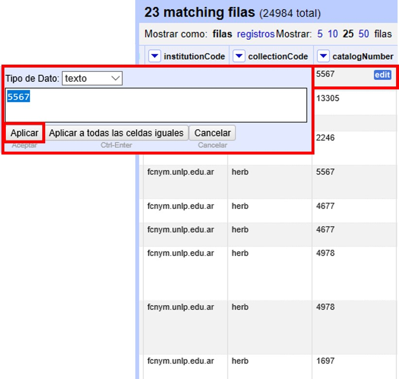

=== Uso de Filtros

==== Filtros simples

OpenRefine permite el uso de filtros sobre campos particulares, función que puede ser muy útil para la limpieza de datos. Veremos un ejemplo a continuación.

Ubique el campo [source]`"specificEpithet"` y cree una faceta de texto (haga click en "la &#9660; azul > Facetas > Faceta de texto"). Luego vaya nuevamente a la &9660; azul y cree un filtro de texto (“Filtro de texto”). Sobre el menú de la izquierda se abrirá una ventana como la que se muestra en la <>.

[#img-fig-25]
.Figura 25

En el cuadro de texto puede escribir el valor sobre el cual desea filtrar.

Por ejemplo, pruebe escribiendo “sp.”. 

En el menú de la izquierda, dentro de la faceta se mostrará el valor que usted buscó, y en la pantalla principal se mostrarán los registros asociados que tienen dicho valor en el campo [source]`"specificEpithet"` (<>).

[#img-fig-26]
.Figura 26
image::img/es.figure-26.jpg[Figura 26,align=center]

Note que verá dos valores, uno en letra minúscula y otro en letra mayúscula. Si sólo desea ver los valores escritos con minúscula, en el filtro debe seleccionar “Distingue mayúsculas y minúsculas”, o puede seleccionar “sp.” directamente sobre la faceta de [source]`"specificEpithet"`.

Corrija los valores “sp.” y “SP.” utilizando la función “editar” sobre los valores en la faceta (el valor correcto debería ser nulo).

Cierre el filtro y la faceta de [source]`"specificEpithet"`.

Abra una faceta de texto y un filtro para el campo [source]`"scientificName"`. En el filtro, busque el valor “sp.”. Verá entonces varios valores para ese campo que incluyen “sp.”, como se muestra en la <>.

[#img-fig-27]
.Figura 27

Debe corregir esos nombres, sacando “sp.” y dejando solamente el nombre del género. Para no tener que hacerlo uno por uno, puede seguir los siguientes pasos.

Haga click sobre "la &#9660; azul en [source]`"scientificName"` > Editar celdas > Transformar…" (<>).

[#img-fig-28]
.Figura 28
image::img/es.figure-28.jpg[Figura 28,align=center]

Se abrirá entonces una ventana como la mostrada en la Figura 29. En el cuadro de texto, pegue la siguiente expresión:
[source,javascript]
----
value.replace(" sp.", "")
----
Dicha expresión tiene la función de reemplazar lo que está entre las primeras comillas por aquello que está entre las segundas comillas, es decir, la porción [source]`" sp."` (`[espacio]sp.`) por [source]``""`` (nada).

En la <> puede observar cómo se vería el resultado del cambio en la pestaña “Vista previa”. 

[#img-fig-29]
.Figura 29
image::img/es.figure-29.jpg[Figura 29,align=center]

Oprima “Aceptar” para ejecutar la transformación, y verá que en la faceta que ha sido filtrada ya no hay registros que contengan “sp.” como parte del valor en el campo [source]`"scientificName"`.

Cierre la faceta y el filtro del campo [source]`"scientificName"`.

==== Filtros con expresiones regulares

Los filtros se pueden utilizar también incluyendo expresiones regulares, que permite buscar ciertos patrones en los valores de los campos. Por ejemplo, se pueden buscar palabras que comiencen con ciertas letras, o que comiencen con mayúscula o minúscula, etc.

A modo de ejemplo, buscaremos valores en el campo [source]`"genus"` que comiencen con minúscula. Para ello, abra una faceta y un filtro de texto para el campo [source]`"genus"`. En el filtro coloque la siguiente expresión en el cuadro de texto: [source,regex]`^[a-z]`, y seleccione las opciones “Distingue mayúsculas y minúsculas” y “regex” (<>). Con dicha expresión se pueden buscar los valores en los que la primera letra es minúscula.

[#img-fig-30]
.Figura 30
image::img/es.figure-30.jpg[Figura 30,align=center]

Siguiendo estos pasos, debería poder ver dos valores (<>). Corrija estos valores filtrados, dado que el género debe comenzar con mayúscula.

OpenRefine acepta un lenguaje de expresiones regulares Java, que puede consultar aquí: http://docs.oracle.com/javase/tutorial/essential/regex/. Algunas expresiones que pueden ser útiles como filtros para diversos campos son:

* `+^[A-C]+`
+
Busca las cadenas de texto que comienzan (`^`) con mayúscula de la A a la C (`[A-C]`)
* `+^[^a-d]+`
+
Busca las cadenas de texto que comienzan (`^`) con cualquier caracter en minúscula salvo de la a a la d (`[^a-d]`) – el `^` dentro del `[]` indica negación.
* `+^\w+`
+
Busca las cadenas de texto que comienzan (`^`) con un una letra (`\w`) –de la a a la z, mayúscula o minúscula.
* `+^\s+`
+
Busca las cadenas de texto que comienzan (`^`) con un espacio en blanco (`\s`).
* `+^\d+`
+
Busca las cadenas de texto que comienzan (`^`) con un dígito (`\d`).
* `+^\D+`
+
Busca las cadenas de texto que comienzan (`^`) con un caracter no dígito (`\D`). Equivalente a la expresión con negación `^[^0-9]`.
* `+\d{4}+`
+
Busca cadenas de texto que contengan dígitos (`\d`), en particular 4 dígitos (`{4}`).
* `+^\w.*\d$+`
+
Busca las cadenas de texto que comiencen (`^`) con una letra (`\w`), sigan (`.`) cualquier caracter (`*`) y terminen (`$`) con un dígito (`\d`).
* `+^[A-Z].*\s[A-Z]+`
+
Busca las cadenas de texto que comienzan (`^`) con mayúscula (`[A-Z]`) –cualquier mayúscula de la A a la Z– seguidas de (`.`) cualquier caracter (`*`), luego un espacio (`\s`), luego otra letra mayúscula (`[A-Z]`).

Pruebe el uso de algunas de esas expresiones en distintos campos.

_Para más ejemplos y usos, puede https://github.com/OpenRefine/OpenRefine/wiki[consultar el repositorio de OpenRefine] en GitHub._
