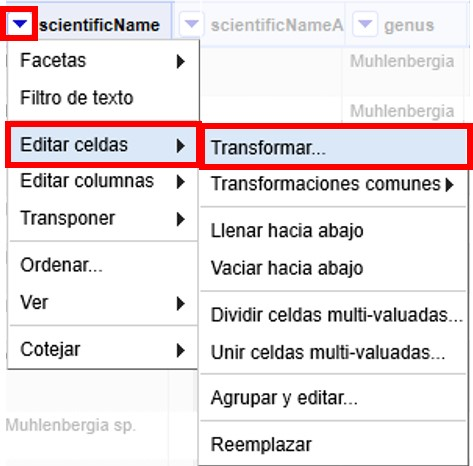
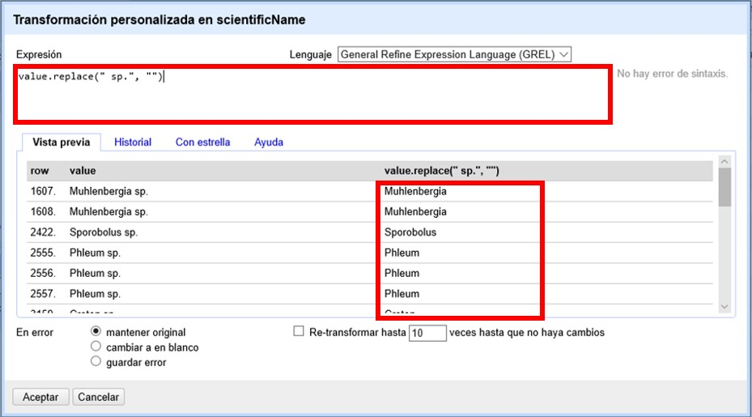

=== Uso de Agrupamientos

==== Agrupamientos simples
Los agrupamientos permiten, como su nombre lo indica, agrupar valores de acuerdo a diferentes criterios. Por ejemplo, pueden agruparse valores de acuerdo al grado de similitud en cuanto a las letras que los componen o en cuanto a la fonética asociada. Esta función es muy útil para corregir errores de ortografía y variaciones en los datos.

Ubique el campo stateProvince y arme una faceta de texto para este campo.

En la ventana de la faceta, haga click en el botón “Agrupar”. Se abrirá entonces una ventana como la mostrada en la <>.

Allí verá que algunos valores que son similares han sido agrupados por un algoritmo. El método y la función utilizados se muestran y se pueden modificar arriba de la lista de valores.

La ventana también muestra el tamaño del clúster (“Número de valores” agrupados), cuántos registros hay por cluster (“Número de filas”) y por valor (entre paréntesis junto a los valores en “Valores en la agrupación”).

[#img-fig-31]
.Figura 31

Además, para cada cluster verá una opción para fusionar los valores (“¿Unir?”) y el nuevo valor que se asignará a todos los registros del cluster (“Nuevo valor de las celdas”). 

OpenRefine asigna de forma predeterminada como nuevo valor aquel que presenta mayor número de registros asociados. Esto no es necesariamente correcto. Por ejemplo, en el caso “Corcega” y “Córcega” el valor correcto lleva tilde. Puede modificar el nuevo valor al que unificará haciendo click en el valor deseado si está listado o, en caso de ser diferente, editando directamente el campo “Nuevo valor de las celdas”. Recuerde que todos los valores dentro de un agrupamiento dado se unificarán al valor escogido. Por ejemplo, en el caso en que los valores agrupados son “NINGUNO” y “ninguno”, podría agrupar a un nuevo valor vacío (pues “ninguno” no es un valor válido para una provincia).

Explore los valores agrupados por el algoritmo y corrija los que considere apropiados, seleccionando el valor correcto y marcando la casilla “¿Unir?”.

Haga click sobre “Unir seleccionados y reagrupar”.

*NOTA IMPORTANTE*: Cuando se agrupan valores se debe tener mucho cuidado a la hora de corregir registros. Esto es particularmente cierto para los nombres científicos, dado que variaciones en los nombres que podrían verse como aparentes errores (por ejemplo, si se evalúa el campo epíteto específico, pueden tenerse dos palabras iguales con diferente terminación –um, –us), no necesariamente lo sean (por ejemplo, si se evalúa también el campo género podría encontrarse que esos epítetos se aplican a géneros distintos, y que ambos son válidos). Por ello, si tiene dudas, consulte los registros completos. Y si aún tiene dudas, consulte en la colección. Otro ejemplo en que debe tenerse extremo cuidado es cuando se agrupan valores que difieren en el orden de las palabras. Un ejemplo típico se da en el campo de colectores. Aún cuando los agrupamientos pueden sugerir que “Colector A y Colector B” es lo mismo que “Colector B y Colector A”, ello puede no ser cierto, y el orden de los colectores puede tener en sí un valor particular. Nuevamente, antes de unificar, es fundamental consultar con la colección.

Una vez resueltos los agrupamientos, si ha decidido no agrupar algunas de las opciones, las verá nuevamente en el re-agrupamiento; en caso contrario, el programa le indicará que no se han encontrado agrupaciones con el método seleccionado. Puede cambiar el método y la función que se utiliza para agrupar escogiendo entre las opciones del menú, como se muestra en la <>.

[#img-fig-32]
.Figura 32

Pruebe agrupamientos con distintos métodos para limpiar los datos.

Para conocer los detalles de cada método de agrupamiento, puede https://github.com/OpenRefine/OpenRefine/wiki/Clustering-In-Depth[consultar el repositorio de OpenRefine en GitHub].
