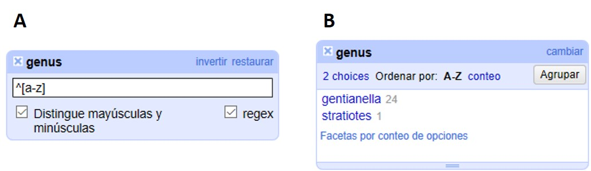
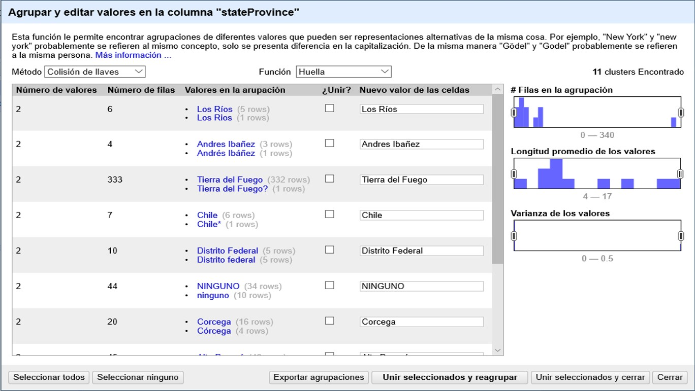
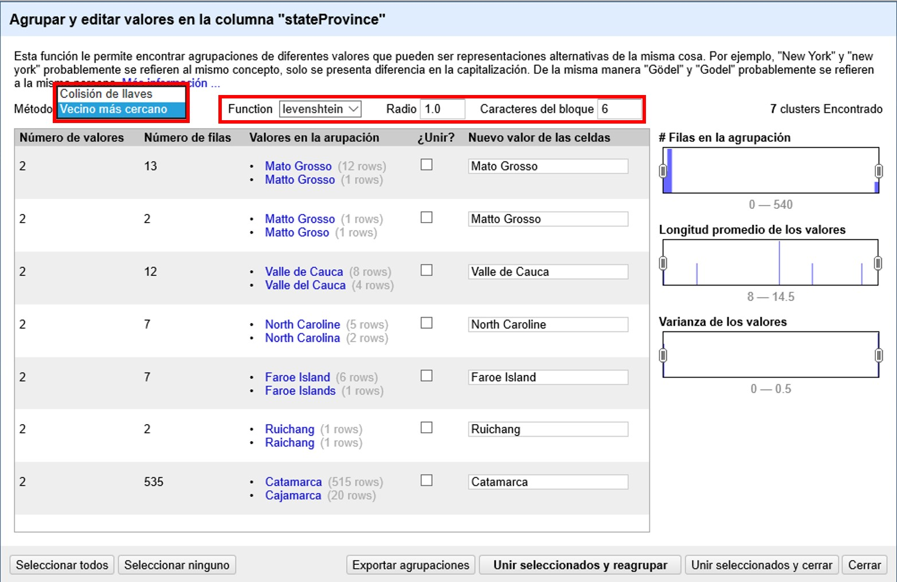

[[sect-2.5]]
=== Deshacer y rehacer cambios

Ahora que ya ha acumulado una serie de modificaciones al conjunto de datos, veamos cómo se pueden deshacer y rehacer cambios.

En el menú de arriba a la izquierda, abra la pestaña “Deshacer/Rehacer”, que está asociada a un número que indica número de cambios acumulados hasta ahora. Verá entonces una lista de pasos realizados, como se muestra en la <>.

Note que el paso resaltado en azul es el que determina el estado de los datos. Todos los pasos hasta el resaltado, inclusive, han sido aplicados a los datos. Todos aquellos pasos ubicados después del paso resaltado no han sido aplicados.

==== Deshacer pasos

Si quiere deshacer todo lo posterior a algún paso, simplemente haga click sobre el paso inmediatamente anterior. Por ejemplo, si quiere deshacer los últimos pasos a partir del paso 5, haga click en el paso 5, y los todos los posteriores se revertirán automáticamente (<>).

[#img-fig-33]
.Figura 33

Para rehacer un paso luego de haberlo deshecho, simplemente haga click en ese paso, teniendo en cuenta que entonces se llevarán a cabo todos los pasos intermedios también.

IMPORTANT: El hacer y deshacer en OpenRefine trabaja sobre “estados”. Eso quiere decir que se puede ir y volver a estados determinados, por ejemplo, el estado de los datos una vez que se han hecho ciertas modificaciones. Ello implica que si se vuelve a un estado anterior y luego se realiza una nueva modificación a partir de ese estado, entonces perderá los pasos originales y no podrá recuperarlos. En el ejemplo de la <>, si se vuelve al paso 5 y luego realiza sobre los datos alguna otra operación, no podrá volver a los pasos 6 a 11 previos.

==== Guardar pasos para rehacer luego

Es importante entonces que guarde sus pasos, especialmente para aquellos procesos más complejos. Para ello, en la pestaña “Deshacer/Rehacer”, haga click en el botón “Extraer…”. Se abrirá una nueva ventana, como se muestra en la <>, donde pueden seleccionar los pasos que desea guardar. Los pasos están dados en formato JSON  en el panel de la derecha.
****
JSON (Java Script Object Notation) es un formato que utiliza texto legible para los humanos para transmitir datos en la forma de pares de atributo:valor y de matrices de datos.
****
Puede marcar y desmarcar pasos en el panel de la izquierda para seleccionar los pasos de interés. Copie las expresiones de los pasos de interés que se muestran a la derecha a un procesador de texto (e.g., Notepad, MS Word, etc.) y guárdelas para uso posterior (en caso de que no esté familiarizado con el formato JSON, recuerde tomar nota de qué cambios representan esas expresiones).

[#img-fig-34]
.Figura 34

IMPORTANT: Los cambios hechos a celdas particulares no tienen la opción de guardar expresiones. En el ejemplo anterior, <>, note que el cambio en una celda única del número de catálogo figura en gris y no puede ser seleccionado. Esto es una limitación actual de OpenRefine, por lo que si va a deshacer un cambio de esta naturaleza pero quiere rehacerlo luego, deberá tomar nota usted mismo de cuál fue el cambio y en qué celda de forma separada (e.g, “Cambié el número de catálogo del registro X, de “1234” a “1236””).

==== Rehacer pasos guardados

Si desea rehacer pasos que tenga guardados (en formato JSON), dentro de la pestaña “Deshacer/Rehacer” haga click en el botón “Aplicar…”. Se abrirá entonces una ventana como la que se muestra en la <>, pero vacía.

Pegue en el cuadro de texto la expresión deseada (copie y pegue lo que guardó en su procesador de texto en el apartado anterior) y haga click en “Ejecutar Operaciones”.

[#img-fig-35]
.Figura 35

De este modo, puede rehacer pasos particulares o toda una rutina de trabajo, sobre el mismo conjunto de datos, o sobre otros conjuntos de datos (siempre y cuando las columnas sean las msimas).
