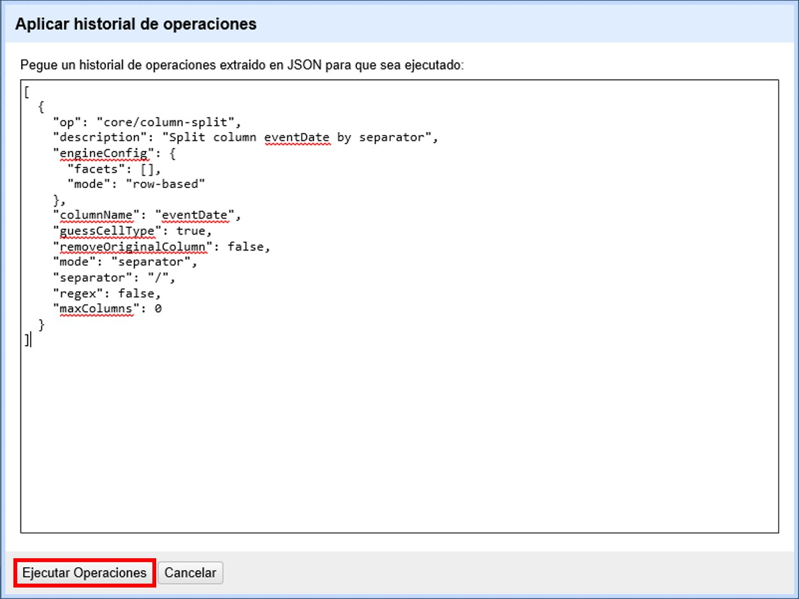

=== Marcado de registros: banderas y estrellas

OpenRefine ofrece la opción de marcar los distintos registros con banderas (flags) y/o estrellas (stars). Esta opción es a veces muy útil para reconocer registros o grupos de registros rápidamente. 

IMPORTANT: Las banderas y estrellas NO forman parte de los datos. Son solamente una herramienta que facilita el trabajo dentro del programa. Por ello, aunque el marcado se registra como un cambio en el historial de cambios del proyecto, cuando exporte los datos NO verá las columnas que corresponden a estas funciones. Es decir, si usted marcó algún registro con una bandera, por ejemplo, no verá esa bandera ni ninguna otra marca indicadora de su existencia en los datos exportados.

==== Marcado con banderas y estrellas

Las banderas y estrellas se encuentran dentro del campo “Todo”. Para marcar un registro con una bandera o estrella, simplemente haga click sobre el ícono correspondiente en ese registro (que se pondrá de color amarillo).

Para desmarcar el registro, haga click nuevamente sobre el ícono (que volverá a su color blanco original).

También puede marcar o desmarcar conjuntos de varios registros. 

Para ello escoja algún criterio que los agrupe. Por ejemplo, si quiere marcar todos los registros del género Acacia, arme una faceta sobre el campo [source]`genus` (haga click sobre la flecha azul del campo -> Facetas -> Faceta de texto).

En la faceta, seleccione el valor “Acacia” haciendo click en el valor (verá que en la ventana principal sólo se mostrarán esos registros). 

Para marcar todos esos registros con una bandera, haga click en la flecha azul del campo “Todo” y siga la siguiente ruta (<>) -> Editar filas -> Marcar filas con bandera

[#img-fig-36]
.Figura 36
image::img/es.figure-36.jpg[Figura 36,align=center]

Una vez que lo haya hecho, verá que todos los registros seleccionados están marcados ahora con una bandera.

Para desmarcar todos esos registros, puede hacer click en la flecha azul del campo “Todo” y seguir la ruta:

_Editar filas -> Desmarcar filas con bandera_

Para marcar y desmarcar registros con estrellas, siga el mismo procedimiento con “estrellas” en lugar de “banderas”.

==== Conservación de banderas y estrellas en la exportación

Si desea marcar los registros de modo que al exportar se conserven las marcas, deberá crear un nuevo campo que capture esa información. Puede, por ejemplo, hacer lo siguiente:

Cree un nuevo campo: sobre cualquier campo haga click en la flecha azul -> Editar columnas -> Agregar columna basada en esta columna...

Se abrirá una ventana como la mostrada en la <>. Asigne un nombre al campo. Por ejemplo, si sus banderas significan que ha detectado errores en los registros, puede llamarlo “tieneError”.

En el cuadro de texto pegue la siguiente expresión:
[source,javascript]
----
if(row.flagged, "yes", "no")
----
Esta expresión hará que el campo nuevo tenga como valor “yes” si usted ha asignado una bandera al registro y “no” si no ha asignado una bandera.

Al oprimir “Aceptar” su campo se habrá creado. Verifique los valores que toma asignando a algunos registros una bandera.

[#img-fig-37]
.Figura 37

Puede repetir el proceso creando otro campo para las estrellas, usando la expresión:
[source,javascript]
----
if(row.starred, "yes", "no")
----
Para ver los pasos de exportación de datos, vea la sección de Exportación de proyectos.

==== Uso de banderas y estrellas para eliminar registros

Las banderas y estrellas se pueden utilizar para eliminar grupos de registros. Para ello, siga los siguientes pasos:

. Marque con una bandera (o estrella) los registros deseados. Puede hacerlo uno por uno o en grupos a través del marcado dentro de facetas (ver más arriba).
. Cree una faceta para la bandera. Haga click en la flecha azul sobre el campo “Todo” -> Facetas -> Faceta por bandera (<>).
. En esta nueva faceta, a la izquierda, seleccione la opción “true” haciendo click sobre ella. Ello le mostrará los registros a los que se ha asignado una bandera.
. Haga click nuevamente sobre la flecha azul del campo “Todo” -> Editar filas -> Eliminar todas las filas que encajen (<>).

[#img-fig-38]
.Figura 38

De esta forma habrá eliminado todos los registros que fueron marcados con una bandera.
