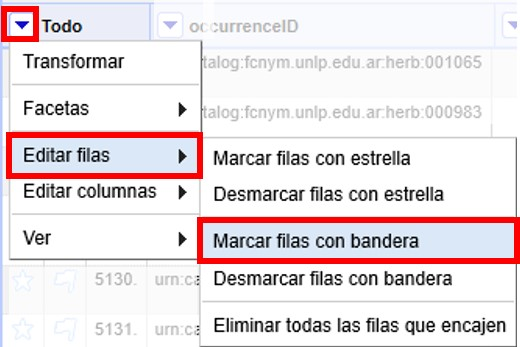
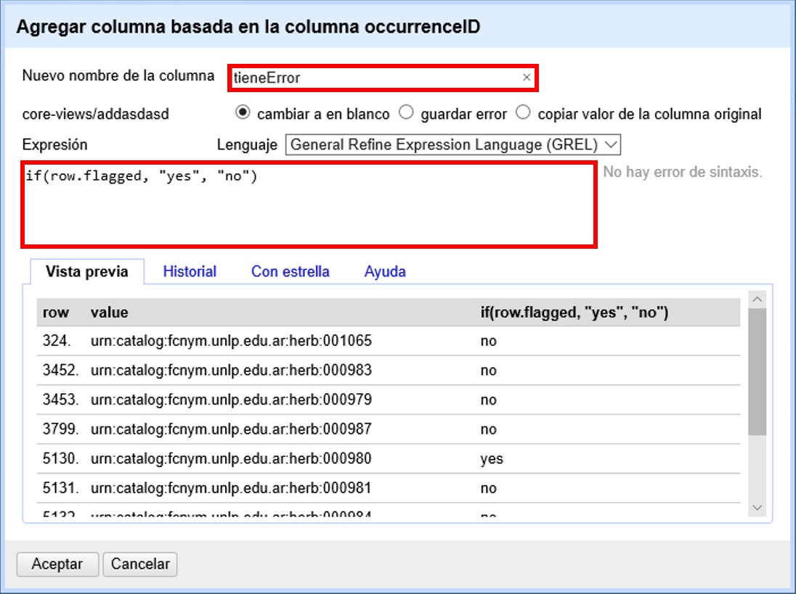

== Guardado y exportación de datos y proyectos

Debe tener en cuenta que lo que guarda al usar el programa es el proyecto, y que ello no implica en ningún caso que los cambios que realice vayan a verse reflejados automáticamente en su base de datos original. Para ello, deberá exportar los datos desde OpenRefine e importarlos nuevamente a su base de datos.

=== Guardado de datos y proyectos

Los proyectos con los que trabaja usando OpenRefine son guardados en su propia computadora de forma automática. En otras palabras, no existe un botón o un comando “Guardar”.

Los directorios en que se guardan los proyectos se listan a continuación:

Windows: dependiendo de la versión de Windows que utilice, los datos se encontrarán en uno de estos directorios:

* C:\Documents and Settings\(user id)\Local Settings\Application Data\OpenRefine
* C:\Users\(user id)\AppData\Roaming\OpenRefine
* C:\Users\(user id)\AppData\Local\OpenRefine
* C:\Users\(user id)\OpenRefine

MacOSX:

* ~/Library/Application Support/OpenRefine/
* ~/Library/Application Support/Google/Refine/ (versions de Google Refine más antiguas)
* Ingreso a través de /var/log/daemon.log - grep para com.google.refine.Refine

Linux:

* ~/.local/share/openrefine/

=== Exportación de datos y proyectos

OpenRefine ofrece varias opciones para exportar los datos y proyectos. Se puede acceder a estas opciones en la esquina superior derecha de la ventana del programa, haciendo click en el botón “Exportar” (<>).

Note que la primera opción, “Exportar proyecto”, permite exportar el proyecto completo, mientras que otras opciones (e.g., delimitado por... , Excel, etc.) permiten exportar los datos.

[#img-fig-39]
.Figura 39
image::img/es.figure-39.jpg[Figura 39,align=center]

La exportación de proyectos es útil cuando uno quiere abrir el mismo proyecto en OpenRefine en otra computadora.

Haciendo click en “Exportar proyecto” se abrirá una ventana en la que puede escoger si exportar como archivo local o si exportar a Google Drive (<>).

[#img-fig-40]
.Figura 40

Escoja la opción deseada y haga click en “Exportar”. El archivo exportado tendrá una extensión .tar.gz, que sólo puede ser abierto por el programa (no se descarga un archivo de datos que pueda abrir en un procesador de textos ni en una planilla de cálculo).

Para exportar los datos y poder abrirlos en otro programa, puede seguir cualquiera de las otras opciones, que resultarán en un archivo con uno de los formatos disponibles.

IMPORTANT: La exportación se realizará teniendo en cuenta las facetas y filtros aplicados. Esto implica que si usted tiene abierta por ejemplo una faceta, sólo los datos correspondientes a dicha faceta serán exportados. Por lo tanto, para exportar todos los datos, recuerde cerrar todos los filtros y facetas antes de hacer la exportación.

Para una exportación más personalizada, en el menú “Exportar” escoja “Configurar exportación...”. Se abrirá una ventana como la mostrada en la <>, en la cual puede escoger una serie de opciones.

[#img-fig-41]
.Figura 41

En la pestaña “Contenido” puede elegir qué campos exportar y modificar ciertos parámetros para cada campo individualmente.

Observe que en esta pestaña también puede escoger ignorar todas las facetas y filtros al exportar, lo cual es muy útil en caso de que haya olvidado cerrar alguna.

Para descargar los datos, vaya a la pestaña “Descarga”, como se ve en la <>.

[#img-fig-42]
.Figura 42

En esta pestaña puede seleccionar el formato de los datos para la descarga. Escoja el que prefiera y haga click en “Descargar”. Inmediatamente comenzará la descarga de los datos.

También, para ver una vista previa de los datos que descargará, puede hacer click en “Vista previa”, y se abrirá otra ventana en su navegador web donde podrá ver una muestra de los datos a descargar.
