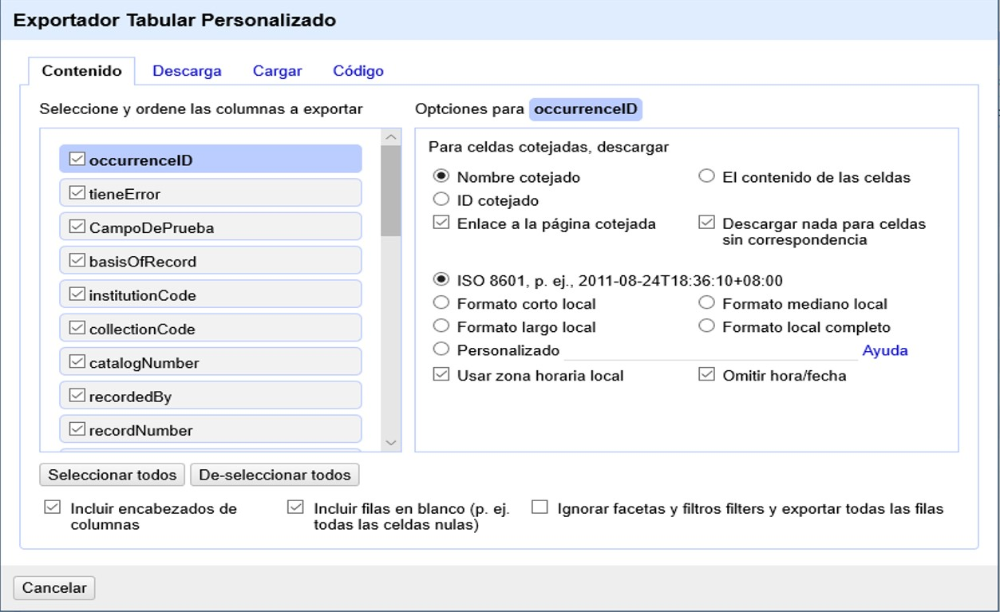

== Consultas a servicios externos

OpenRefine ofrece la posibilidad de consultar fuentes externas, una función que es muy útil cuando se intenta mejorar la calidad de los datos. Para el caso particular de datos sobre biodiversidad, permite, por ejemplo, validar nombres taxonómicos y geográficos contra fuentes de información que se consideren confiables, completar rangos taxonómicos y campos geográficos superiores, georreferenciar, incorporar enlaces a imágenes almacenadas en sitios web, entre otros.

En OpenRefine las consultas externas pueden realizarse por dos vías: a través de URLs, o a través de servicios de reconciliación. En esta guía sólo se incluyen los métodos referidos a las consultas a través de URLs. Para ver explicaciones referidas al uso de algunos servicios de reconciliación consultar versiones anteriores de este documento; tener en cuenta que esos servicios no han sido actualizados en concordancia con las actualizaciones de OpenRefine, y muchos no funcionan a partir de OpenRefine 2.8.

NOTA: Debe recordarse que para poder realizar consultas a servicios que se encuentran en línea se requiere conexión a internet. 

NOTA: La velocidad a la que se obtienen los resultados de las consultas depende de la velocidad de respuesta del servicio en particular. De esta forma, si se quieren comparar muchos registros, el tiempo de la operación será prolongado. Para acortar tiempos, se pueden hacer comparaciones de registros contra el servicio deseado dentro de una faceta, es decir, en una fracción particular de los registros. 

=== Consultas externas a través de URLs

Nos referimos a consultas a través de URLs cuando el proceso implica proveer a OpenRefine con la dirección web (URL) de un determinado servicio y ciertos parámetros mínimos para obtener de dicho servicio un resultado.

==== Resolución de nombres científicos usando Global Names Resolver

En el ejemplo siguiente, compararemos los nombres científicos (contenidos en el campo [source]`scientificName`) contra el servicio Global Names Resolver (http://resolver.globalnames.org, de aquí en más GNR).

Para acortar el tiempo de consulta, cree una faceta para el campo [source]`genus` (click en la flecha azul --> Facetas --> Faceta de texto) y dentro de ella escoja el género Cinna. En el conjunto de datos utilizado Cinna parece tener 3 especies asociadas: C. lateralis (1 registro), C. arundinacea (6 registros) y C. latifolia (3 registros).

Para comparar los nombres contra el GNR, haremos un llamado al servicio y capturaremos los resultados en un nuevo campo:

A partir del campo [source]`scientificName`, cree una nueva columna a partir de una dirección URL haciendo click en la flecha azul del campo y siguiendo la siguiente ruta (<>):

Editar columnas 	--> Agregar columna accediendo a URLs...

[#img-fig-43]
.Figura 43
image::img/es.figure-43.jpg[Figura 43,align=center]

Se abrirá una ventana como la mostrada en la <>. Allí, dé un nombre al nuevo campo (por ejemplo, GNR_Json_sciName), y en el cuadro de texto coloque la siguiente expresión:

[source,javascript]
----
"http://resolver.globalnames.org/name_resolvers.json?names=" +
  escape(cells["scientificName"].value,"url")
----

Dicha expresión indica se hará una consulta en el GNR utilizando como valores de comparación aquellos que se encuentran en el campo [source]`scientificName`. Es importante que el nombre del campo que utiliza en la expresión sea idéntico al nombre del campo del cual tomará los valores originales, o de otro modo el llamado será infructuoso.

[#img-fig-44]
.Figura 44
image::img/es.figure-44.jpg[Figura 44,align=center]

Note que en esta ventana, arriba a la derecha, tiene una opción para modificar el “Tiempo de retraso”. Este valor indica el tiempo que transcurre entre llamados o consultas sucesivas que se hacen al servicio en cuestión. Por defecto, el valor es de 5000 milisegundos. Puede reducir este tiempo para acelerar el proceso de comparación. Tenga en cuenta, sin embargo, que muchos servicios bloquean los llamados si éstos ocurren muy cercanos en el tiempo, pues consideran que puede tratarse de un ataque. El máximo número de consultas que pueden realizar por unidad de tiempo depende de cada servicio en particular. 

NOTA: La expresión utilizada es muy general, y devolverá los valores de todos los parámetros que GNR provee respecto de un nombre científico. Puede consultar dichos parámetros en http://resolver.globalnames.org/api. Si no quiere obtener en el resultado todos los valores, puede modificar la expresión especificando valores para todos o algunos de los parámetros. Por ejemplo: GNR resuelve los nombres consultando diferentes fuentes, a las que asigna identificadores (data_source_id); si sólo quiere obtener los resultados provenientes de la fuente Catalogue of Life (que en GNR tiene id=1), puede utilizar la siguiente expresión:
[source,javascript]
----
"http://resolver.globalnames.org/name_resolvers.json?names=" +
  escape(cells["scientificName"].value,"url") +
  "&data_source_ids=1"
----
Una vez que haya creado el nuevo campo con la expresión general, verá que contiene, en formato JSON, los resultados de la consulta en GNR para cada nombre, con todos los parámetros y valores que GNR reporta.

Para poder trabajar con esto más cómodamente, debemos extraer de allí los valores de interés.

Dado que GNR consulta varias fuentes de nombres taxonómicos, nos interesa saber cuál es el nombre científico que figura en cada fuente. Algunas fuentes pueden tener listado el nombre pero considerarlo inválido y proveer el nombre correcto. Entonces, extraeremos del resultado en JSON, en un nuevo campo, los siguientes valores:

* Fuente consultada: "data_source_title"
* Nombre encontrado en la fuente: "name_string"
* Nombre aceptado por la fuente: "current_name_string"

Para ello, a partir del campo en JSON (en el ejemplo, GNR_Json_sciName), cree un nuevo campo (haga click en la flecha azul -->  Editar columnas --> Agregar columna basada en esta columna).

Dé un nombre al nuevo campo (por ejemplo, GNR_sciName_options) y en el cuadro de texto, coloque la siguiente expresión (<>): 

[source,javascript]
----
forEach(value.parseJson().get("data")[0].get("results"), v,
  v.get("data_source_title") + "; " +
  v.get("name_string") + "; " +
  if(isBlank(v.get("current_name_string")), "", v.get("current_name_string")))
.join(" | ")
----

Dicha expresión analiza la cadena en formato JSON, que tiene dentro de su estructura secciones “data” y dentro de esta “results” –un “result” proveniente de cada fuente consultada (por ejemplo, un “result” de Catalogue of Life). Dentro de cada sección “results” extrae los valores de interés (“data_source_title”, “name_string” y “current_name_string”) y los separa con un “;”. Como no todas las fuentes proveen un nombre aceptado (“current_name_string”), la expresión [source]`if` especifica que si ese parámetro es nulo debe dejarse el espacio vacío ([source]``""``), y si no, colocar el valor extraído. Por último, une los grupos de valores extraídos en una única cadena de texto, separados por un [source]` | `.

[#img-fig-45]
.Figura 45

Una vez que haya creado el campo, verá que contiene, aún en formato JSON, los valores de interés extraídos de GNR. Por ejemplo:

----
uBio NameBank; Cinna lateralis; | Catalogue of Life; Cinna lateralis Walter; Andropogon virginicus L. | ITIS; Cinna lateralis Walter; Andropogon virginicus L. | GBIF Backbone Taxonomy; Cinna lateralis Walter; Andropogon virginicus L. | EOL; Cinna lateralis Walter; | Tropicos - Missouri Botanical Garden; Cinna lateralis Walter; | The International Plant Names Index; Cinna lateralis Walter; | uBio NameBank; Cinna lateralis Walter; | uBio NameBank; Cinna lateralis Walter, 1788; | Arctos; Cinna lateralis Walter;
----

Note que algunas fuentes encuentran el nombre pero no proveen un nombre aceptado, por ejemplo: 

----
uBio NameBank; Cinna lateralis;
----

no tiene un valor en el tercer lugar, mientras que:

----
Catalogue of Life; Cinna lateralis Walter; Andropogon virginicus L.
----

provee el nombre encontrado y el nombre válido.

Note además que algunas fuentes tienen más de una variante asociada al nombre, por ejemplo:

----
uBio NameBank; Cinna lateralis;
uBio NameBank; Cinna lateralis Walter;
uBio NameBank; Cinna lateralis Walter, 1788;
----

IMPORTANT: No todos los nombres serán necesariamente encontrados en todas las fuentes consultadas, por lo que el número de fuentes variará de un nombre al otro. En consecuencia, la ubicación de las fuentes en la cadena de texto no será homogénea de un registro al otro. Una consecuencia de esto es que si usted quiere luego separar el contenido en campos distintos de acuerdo a la fuente consultada (e.g., un campo para ITIS, uno para Catalogue of Life, etc.), no podrá hacerlo de modo que cada nuevo campo tenga los datos de una misma y única fuente.

En este caso, le conviene en cambio hacer varios llamados a GNR separados, cada uno especificando una fuente determinada. Como se menciona más arriba, si quiere por ejemplo sólo consultar los valores dados por Catalogue of Life, use la expresión siguiente:

[source,javascript]
----
"http://resolver.globalnames.org/name_resolvers.json?names=" +
  escape(cells["scientificName"].value,"url") +
  "&data_source_ids=1"
----

y luego arme un nuevo campo extrayendo los resultados de interés, usando la expresión:

[source,javascript]
----
forEach(value.parseJson().get("data")[0].get("results"), v,
  v.get("data_source_title") + "; " +
  v.get("name_string") + "; " +
  if(isBlank(v.get("current_name_string")), "", v.get("current_name_string")))
.join(" | ")
----

A partir de los resultados obtenidos, puede extraer los nombres separando la nueva columna en columnas distintas utilizando separadores apropiados (ver sección de separación de columnas).

==== Georreferenciación usando GeoLocate

En este ejemplo, para facilitar la explicación y reducir el tiempo de consulta al servicio, construiremos previamente dos facetas. La primera sobre el campo [source]`country`, dentro de la cual seleccionaremos el valor “Argentina”. La segunda faceta será sobre el campo [source]`genus`, dentro de la cual seleccionaremos el valor “Acacia”. Una vez aplicadas ambas facetas y escogidos los valores, verá que en la ventana principal sólo se muestra un subconjunto de registros que cumplen estas condiciones simultáneamente.

Llevaremos a cabo la georreferenciación a partir del campo [source]`locality`. Para ello, cree un nuevo campo a partir de éste siguiendo la ruta: click en la flecha azul --> Editar columnas --> Agregar columna accediendo a URLs…

Se abrirá una nueva ventana (<>). Allí dé un nombre al nuevo campo, por ejemplo “GeoLocate_Json_georref”, y pegue en el cuadro de texto la siguiente expresión:

[source,javascript]
----
"http://www.museum.tulane.edu/webservices/geolocatesvcv2/glcwrap.aspx?Country=Argentina&fmt=json&Locality=" +
  escape(value,'url')
----

En esta expresión, `fmt` indica el formato en el que el resultado será devuelto por el servicio. GeoLocate ofrece dos posibles formatos, JSON y GeoJSON.

[#img-fig-46]
.Figura 46

Una vez que haya creado el nuevo campo con la expresión general, verá que contiene, en formato JSON, los resultados de la consulta en GeoLocate para cada localidad, con todos los parámetros y valores que este servicio reporta.

En los resultados puede tener tres casos:

*Caso 1)* Ningún resultado encontrado. Ello quiere decir que GeoLocate no ha podido ubicar la localidad de interés. En la celda correspondiente verá lo siguiente:
[source,javascript]
----
{
  "engineVersion" : "GLC:5.21|U:1.01374|eng:1.0",
  "numResults" : 0,
  "executionTimems" : 171.6003
}
----

*Caso 2)* Un único resultado encontrado. En la celda correspondiente verá, por ejemplo, lo siguiente:
[source,javascript]
----
{
  "engineVersion": "GLC:5.21|U:1.01374|eng:1.0",
  "numResults": 1,
  "executionTimems": 171.6003,
  "resultSet": {
    "type": "FeatureCollection",
    "features": [
      {
        "type": "Feature",
        "geometry": {
          "type": "Point",
          "coordinates": [ -64.471941, -23.643418 ] <1>
        },
        "properties": {
          "parsePattern": "YUTO", <2>
          "precision": "High",
          "score": 79,
          "uncertaintyRadiusMeters": 3036, <3>
          "uncertaintyPolygon": "Unavailable", <4>
          "displacedDistanceMiles": 0, <5>
          "displacedHeadingDegrees": 0,
          "debug": ":GazPartMatch=False|:inAdm=True|:Adm=JUJUY|:NPExtent=5040|:NP=YUTO|:KFID=|YUTO" <6>
        }
      }
    ],
    "crs": { "type": "EPSG", "properties": { "code": 4326 } }
  }
}
----
<1> Las coordenadas: [source,javascript]`"coordinates": [-64.471941, -23.643418]`
<2> Las localidad original que consultó: `"parsePattern" : "YUTO"`
<3> El radio de incerteza en metros: `"uncertaintyRadiusMeters" : 3036`
<4> El polígono de incerteza asociado: `"uncertaintyPolygon" : "Unavailable"`, en este caso no disponible.
<5> Los desplazamientos: distancia en millas y grados en una dirección: `"displacedDistanceMiles" : 0, "displacedHeadingDegrees" : 0`, en este caso con valores `0` porque no se especifica desplazamiento de ningún tipo en la localidad (e.g., 45km de Yuto, o 45km N Yuto).
<6> La correspondencia en el gacetero consultado: `GazPartMatch`, y en éste la división administrativa bajo la cual se encontró la localidad: `|:Adm=JUJUY|`.

*Caso 3)* Varios resultados encontrados para un mismo valor de localidad. Esto sucede comúnmente cuando no se especifican en la consulta niveles administrativos por debajo de país (e.g., podría haber en un mismo país varios lugares con el mismo nombre). Un ejemplo sería:
[source,javascript]
----
{
  "engineVersion": "GLC:5.21|U:1.01374|eng:1.0",
  "numResults": 3, <1>
  "executionTimems": 187.2004,
  "resultSet": {
    "type": "FeatureCollection",
    "features": [
      {
        "type": "Feature",
        "geometry": {
          "type": "Point",
          "coordinates": [ -64.158097, -26.21252 ] <2>
        },
        "properties": {
          "parsePattern": "TARTAGAL", <3>
          "precision": "High",
          "score": 83,
          "uncertaintyRadiusMeters": 301,
          "uncertaintyPolygon": "Unavailable",
          "displacedDistanceMiles": 0,
          "displacedHeadingDegrees": 0,
          "debug": ":GazPartMatch=False|:inAdm=True|:Adm=SANTIAGO DEL ESTERO|:NPExtent=500|:NP=TARTAGAL|:KFID=|TARTAGAL" <4>
        }
      },
      {
        "type": "Feature",
        "geometry": {
          "type": "Point",
          "coordinates": [ -59.846115, -28.671732 ] <2>
        },
        "properties": {
          "parsePattern": "TARTAGAL", <3>
          "precision": "High",
          "score": 83,
          "uncertaintyRadiusMeters": 3036,
          "uncertaintyPolygon": "Unavailable",
          "displacedDistanceMiles": 0,
          "displacedHeadingDegrees": 0,
          "debug": ":GazPartMatch=False|:inAdm=True|:Adm=SANTA FE|:NPExtent=5040|:NP=TARTAGAL|:KFID=|TARTAGAL" <4>
        }
      },
      {
        "type": "Feature",
        "geometry": {
          "type": "Point",
          "coordinates": [ -63.801314, -22.516365 ] <2>
        },
        "properties": {
          "parsePattern": "TARTAGAL", <3>
          "precision": "High",
          "score": 83,
          "uncertaintyRadiusMeters": 3036,
          "uncertaintyPolygon": "Unavailable",
          "displacedDistanceMiles": 0,
          "displacedHeadingDegrees": 0,
          "debug": ":GazPartMatch=False|:inAdm=True|:Adm=SALTA|:NPExtent=5040|:NP=TARTAGAL|:KFID=|TARTAGAL" <4>
        }
      }
    ],
    "crs": { "type": "EPSG", "properties": { "code": 4326 } }
  }
}
----

Note que los tres resultados del ejemplo corresponden a provincias distintas en las que se encuentra una localidad “Tartagal”, puede comparar las coordenadas para cada una.

[NOTE]
.Visualizando JSON
--
Para visualizar la estructura de los resultados en JSON de modo más amigable, puede probar copiando el resultado de alguna celda en un analizador de JSON en línea. Existen muchas opciones, una de ellas es http://json.parser.online.fr/. Allí, seleccionando distintas opciones arriba a la derecha podrá distinguir mejor la estructura, cuáles son los objetos, los arreglos y las cadenas de texto y cómo están relacionados unos con otros (Figura 47). Esto puede ser muy útil a la hora de armar expresiones para desglosar el contenido de los campos en nuevos campos sin perder información.

[#img-fig-47]
.Figura 47

--

*NOTA:* La expresión utilizada es muy simple y sólo le pide al servicio que resuelva la georreferenciación en base al campo localidad y teniendo como valor fijo “Argentina” para el campo país, pero sin especificar los valores de otros campos geográficos. Sin embargo, todos los campos se pueden incluir en la expresión para obtener resultados más específicos. Ello puede hacerse de dos maneras:

. Establecer los valores de los campos como valores fijos, como hicimos con el país, agregando luego por ejemplo: `&state=VALOR` donde VALOR es el valor fijo que uno establece (e.g., “Córdoba”). Esto restringirá los resultados en función de esos parámetros.
. Incluir los campos como valores a consultar, en cuyo caso para cada campo hay que incluir como valor: [source,javascript]`+escape(cells.NOMBREDELCAMPO.value.'url')+`

La expresión con todos los campos se verá entonces como:
[source,javascript]
----
"http://www.museum.tulane.edu/webservices/geolocatesvcv2/glcwrap.aspx?country=Argentina&state=" +
  escape(cells.stateProvince.value,'url')+"&locality="+escape(cells.locality.value,'url')
----
Note que el nombre del campo será el que tiene en su base de datos. Note también que en la base de datos dada para este ejercicio no hay un campo correspondiente a [source]`county`, pero GeoLocate permite incluirlo si lo hubiera.

Para poder trabajar con estos resultados más cómodamente, debemos extraer de allí los valores de interés. En este paso debe tener cuidado. Debido a que no especificamos todos los campos geográficos en la consulta a GeoLocate, recuerde que los registros pueden tener más de un resultado posible, y que cada resultado tiene sus propios parámetros de georreferenciación.

A modo de ejemplo, extraeremos en nuevos campos los valores de las coordenadas. (El conjunto de datos provisto para realizar los ejercicios de esta guía contiene campos originales de latitud y longitud provistos por la fuente, puede utilizarlos para contrastar los resultados obtenidos utilizando GeoLocate).

Para extraer las coordenadas puede seguir dos métodos: 1) extraer latitud y longitud conjuntamente y luego separar; o 2) extraer latitud y longitud de modo independiente.

*Método 1:* extraer latitud y longitud conjuntamente

Haga click en la flecha azul del campo GeoLocate_Json_georref --> Editar columnas --> Agregar columna basada en esta columna.

De un nombre al nuevo campo, por ejemplo, GeoLocate_parseCoord, y en el cuadro de texto pegue la siguiente expresión:

[source,javascript]
----
forEach(filter(value.parseJson().resultSet.features, v, isNonBlank(v.geometry)), w,
  w.geometry.coordinates.join("; "))
.join("|")
----

Esta expresión es un poco más compleja que las que hemos estado utilizando, debido a que se requiere extraer información de una estructura Json particular Objeto --> Arreglo --> Objeto --> Arreglo. (Puede visualizar la estructura en JSON como se menciona en la nota de la Figura 47).

El nuevo campo tendrá valores como los siguientes, por ejemplo, para un registro cuya consulta devolvió tres resultados:
[source]
----
-64.158097; -26.21252|-59.846115; -28.671732|-63.801314; -22.516365
----

IMPORTANT: Note que GeoLocate provee como primer valor de coordenadas la longitud y como segundo valor la latitud.

Dividiremos ahora este campo en tres partes, una para cada resultado:

Haga click en la flecha azul del campo --> Editar columnas --> Dividir en varias columnas.

Escoja como separador `|`. Desmarque la opción “Eliminar esta columna” si quiere mantener el campo original (esto es recomendable, siempre puede eliminar los campos después).

Tendrá entonces ahora una serie de campos con valores del tipo: `-64.158097; -26.21252`. Sobre cada uno, puede realizar una nueva separación utilizando como separador `;`.

*Método 2:* extraer latitud y longitud independientemente

Haga click en la flecha azul del campo GeoLocate_Json_georref --> Editar columnas --> Agregar columna basada en esta columna.

De un nombre al nuevo campo, por ejemplo, GeoLocate_parseLong, y en el cuadro de texto pegue la siguiente expresión:
[source,javascript]
----
forEach(filter(value.parseJson().resultSet.features, v, isNonBlank(v.geometry)), w,
  w.geometry.coordinates[0]).join("; "))
.join("|")
----
Esta expresión es diferente a la usada anteriormente en que se especifica qué valor del arreglo coordenadas se desea obtener: `[0]`. En OpenRefine, el primer valor se indica con 0, el segundo con 1, y así sucesivamente. Dado que en los resultados de la consulta se indica primero la longitud, ésta será el valor `[0]`, y la latitud será el valor `[1]` dentro del arreglo “coordinates”.

El nuevo campo creado tendrá valores como los siguientes: `-64.158097; -59.846115; -63.801314` cada uno correspondiente a una longitud de uno de los resultados obtenidos de la consulta a GeoLocate para un determinado registro.

Puede repetir el proceso para obtener las latitudes, cambiando en la expresión anterior `[0]` por `[1]`, y luego separar los campos por resultado, utilizando como separador `;`.

IMPORTANT: Debe tener en cuenta que, como se mencionó antes, cuantos más datos se provean al servicio de GeoLocate en la consulta más sencillo será desglosar los resultados después. El proceso de desglose puede ser muy engorroso y requiere que sea muy meticuloso a la hora de nombrar campos y separar contenido. Si no está familiarizado con el uso de JSON, es preferible que realice el desglose “pasito a pasito” para evitar perder o mezclar información. Por ejemplo, puede crear un documento con el flujo de trabajo donde enumere los pasos a seguir con todos los detalles necesarios (incluya allí el tipo de resultados que espera ver y cómo se verían en los campos).

IMPORTANT: A la hora de agregar datos de georreferenciación, contraste siempre los resultados contra los campos geográficos que tiene. En el caso de tener varios resultados posibles, no siempre el primer resultado es el correcto. Recuerde reportar cuál fue el proceso de georreferenciación utilizado y todos los parámetros posibles asociados. Para consultar en qué campos de Darwin Core se reporta cada parámetro, puede referirse a: http://rs.tdwg.org/dwc/terms/#location, y consultar: https://github.com/tdwg/dwc-qa/wiki/Georeferences.
