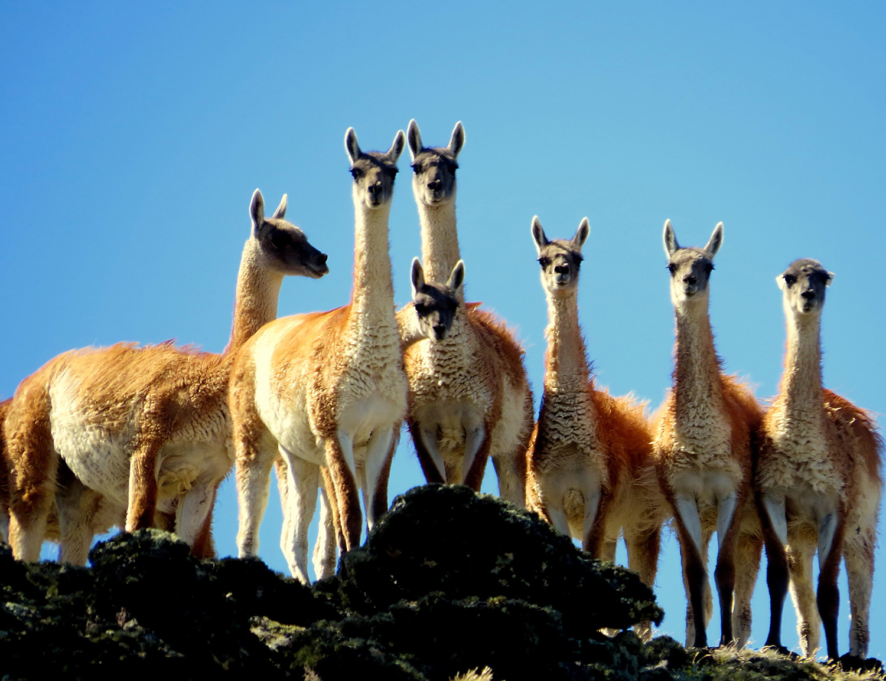

ifdef::backend-html5[]

endif::backend-html5[]

== Colofón

=== Cita bibliográfica sugerida
Zermoglio PF & Wieczorek JR (2020) Guía de Uso Básico de OpenRefine para la limpieza de datos sobre biodiversidad, Versión 3. Copenhagen: GBIF Secretariat. https://doi.org/10.15468/doc-gzjg-af18.

=== Licencia
El documento Guía de Uso Básico de OpenRefine para la limpieza de datos sobre biodiversidad se publica bajo una licencia https://creativecommons.org/licenses/by-sa/4.0/deed.es[Atribución-CompartirIgual 4.0 Internacional].

=== URI persistente
https://doi.org/10.15468/doc-gzjg-af18

=== Control de documentos
Versión 3, edición de revisión comunitaria, Marzo 2020.

// if desired, include reference to provenance
Este documento se basa en una publicación anterior de la guía por los mismos autores.

=== Imagen de la portada
Una manada de guanaco (_Lama guanicoe_), Lago Argentino, Santa Cruz, Argentina. Foto 2016 Diego Carús via https://www.gbif.org/occurrence/2005372769[iNaturalist Research-grade Observations], licenciada bajo http://creativecommons.org/licenses/by-nc/4.0/[CC BY-NC 4.0].

<<<
